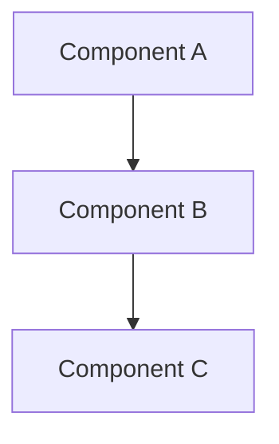

# SpecMind Constitution

This document defines the core architectural decisions, principles, and constraints for the SpecMind project. All code, features, and decisions must align with this constitution.

**Last Updated:** 2025-10-16
**Version:** 1.3.0

## Changelog
- **v1.3.0** (2025-10-16): Added README sync rule - all user-facing changes in CONSTITUTION.md must be reflected in README.md. Created comprehensive README aligned with constitution.
- **v1.2.0** (2025-10-16): Defined file naming convention - `system.sm` for root, kebab-case slugified names for features. No timestamps in filenames, git history for versioning.
- **v1.1.0** (2025-10-16): Updated .sm file format to include both markdown documentation and architecture diagrams (not just diagrams). Added file organization structure and one-file-per-feature principle.
- **v1.0.0** (2025-10-16): Initial constitution established

---

## 1. Project Vision

**Mission:** Create a developer experience where architecture evolves with code, not after it — turning every feature into a visual, validated, and optimized design.

**Core Workflow:** Spec-driven vibe coding where architecture and implementation stay in sync from the very first commit.

---

## 2. Architectural Decisions

### 2.1 Monorepo Structure

**Decision:** Single monorepo containing all packages (core, format, CLI, VS Code extension)

**Rationale:**
- Shared code reuse (especially .sm format parser/renderer)
- Version synchronization across packages
- Atomic updates when format evolves
- Single place for issues and contributions
- Easier coordination of breaking changes

**Tool:** pnpm workspaces

### 2.2 Programming Language

**Decision:** Full TypeScript stack for all packages

**Rationale:**
- VS Code extension requires TypeScript/JavaScript
- Single language simplifies contributions and maintenance
- Excellent ecosystem for LLM integration (@anthropic-ai/sdk, openai)
- Type sharing across all packages
- Simple distribution (single npm install)
- Great developer experience with modern tooling

**Stack:**
- TypeScript 5.x+
- Node.js 18+ runtime
- ES Modules (ESM)

### 2.3 Code Analysis & Parsing

**Decision:** Use tree-sitter for all code analysis and parsing

**Rationale:**
- Multi-language support (50+ languages) out of the box
- Same parser VS Code uses - battle-tested and fast
- Incremental parsing for performance
- Excellent TypeScript bindings
- Can parse files, classes, modules, functions, and extract relationships
- Unified approach across all supported languages

**Analysis Capabilities:**
- Extract all files, classes, modules, functions
- Identify relationships and dependencies between components
- Build component graphs
- Support for TypeScript, Python, Go, Rust, Java, and more

---

## 3. Package Architecture

### 3.1 Package Boundaries

```
specmind/
├── packages/
│   ├── core/       # @specmind/core - Pure analysis logic
│   ├── format/     # @specmind/format - .sm file format
│   ├── cli/        # specmind - CLI tool
│   └── vscode/     # VS Code extension
```

### 3.2 Package Responsibilities

#### @specmind/core
- Code analysis using tree-sitter
- Architecture diagram generation
- Architecture diffing
- LLM orchestration
- **No CLI or UI dependencies**
- Exports clean, typed API

**Key Modules:**
- `analyzer/` - Tree-sitter based code analysis
- `generator/` - Architecture diagram generation
- `differ/` - Architecture diffing logic
- `llm/` - LLM client and prompt management

#### @specmind/format
- .sm file parser
- .sm file writer
- .sm file validator
- Mermaid.js integration for rendering
- Zod schemas for type definitions
- **Standalone package** - can be used independently

#### specmind (CLI)
- Thin wrapper around @specmind/core
- Command implementations (init, design, implement)
- Terminal UI (chalk, ora, etc.)
- Git integration

#### vscode (VS Code Extension)
- .sm file viewer with visual rendering
- Syntax highlighting for .sm files
- Webview panel for diagram visualization
- Inline annotations and warnings
- Optional CLI integration (if installed)

### 3.3 Dependency Rules

```
vscode → format (required)
vscode → cli (optional, via subprocess)

cli → core (required)
cli → format (required)

core → format (required)

format → (no internal dependencies)
```

---

## 4. Core Features

### 4.1 Slash Commands

Primary interface for AI coding assistants (Cursor, Windsurf, GitHub Copilot, Claude Code)

**Core Commands:**

#### `/init`
- Analyzes connected repository using tree-sitter
- Parses all code files to extract components and relationships
- Generates initial architecture overview
- Creates `.specmind/system.sm` with system architecture + documentation
- Creates `.specmind/features/` directory for future feature specs

#### `/design <feature-name>`
- Analyzes code and user intent for new feature
- Slugifies feature name (e.g., "User Auth" → "user-auth")
- Creates `.specmind/features/{slugified-name}.sm` with:
  - Feature overview and requirements (markdown)
  - Proposed architecture diagram (Mermaid)
  - Design decisions and rationale
  - Integration points with existing system
- Proposes architectural diff showing changes to system.sm
- Updates existing feature .sm file if already exists

#### `/implement <feature-name>`
- Reads `.specmind/features/{slugified-name}.sm` for context
- Implements code aligned with documented architecture
- Ensures structural and intent alignment
- Updates the feature .sm file if implementation diverges from design
- Adds notes/warnings to .sm file based on implementation learnings
- Updates system.sm if system-level changes were made

### 4.2 .sm File Format

**Decision:** Feature specification files with .sm extension containing both markdown documentation and architecture diagrams

**Format:** Hybrid format combining:
- **Markdown sections** - Feature description, requirements, design decisions, notes
- **Mermaid.js diagrams** - Architecture visualization (extended with custom annotations)

**Structure:**
```markdown
# Feature Name

## Overview
[Markdown description of the feature]

## Requirements
- [Requirement 1]
- [Requirement 2]

## Architecture



## Design Decisions
[Rationale and architectural choices]

## Notes
[Warnings, optimization tips, duplication alerts]
```

**Storage Location:** `.specmind/` folder in repository root

**File Organization:**
```
.specmind/
├── system.sm               # Root system architecture (generated by /init)
├── features/
│   ├── user-auth.sm       # Feature: User Authentication
│   ├── payment-flow.sm    # Feature: Payment Processing
│   └── analytics-dashboard.sm  # Feature: Analytics Dashboard
└── services/              # (Future: microservices)
    ├── api-gateway.sm
    └── user-service.sm
```

**Naming Convention:**

**Root File:**
- **`system.sm`** - Generated by `/init` command
- Contains system-level architecture overview
- Single file per repository

**Feature Files:**
- **Location:** `.specmind/features/{feature-name}.sm`
- **Format:** Kebab-case, lowercase, slugified from feature name
- **Examples:**
  - `"User Authentication"` → `user-authentication.sm`
  - `"Payment Flow"` → `payment-flow.sm`
  - `"Real-time Notifications"` → `real-time-notifications.sm`

**Naming Rules:**
1. Convert to lowercase
2. Replace spaces and special characters with hyphens (`-`)
3. Remove leading/trailing hyphens
4. Use descriptive, meaningful names
5. No timestamps in filename (use git history for versioning)

**File Lifecycle:**
- `/init` creates `system.sm`
- `/design "Feature Name"` creates `features/feature-name.sm`
- Subsequent `/design "Feature Name"` updates the same file
- Git history tracks all changes and evolution
- Manual rename if feature name changes significantly

**One .sm file per feature:**
- Each feature gets its own .sm file
- File contains complete context: description + diagram + decisions
- Easy to understand feature architecture at a glance
- Self-documenting - reduces need for external docs
- Traceable evolution through git history

**Features:**
- Human-readable and git-friendly
- Visual rendering in VS Code (markdown + diagram)
- Support for annotations (warnings, optimization tips, duplication alerts)
- Versioned alongside code
- Searchable documentation + architecture in one place
- Can be used in code reviews and design discussions
- Rich context for LLMs when implementing features

---

## 5. User Interfaces

### 5.1 Primary Interface: Slash Commands
- Works across multiple AI assistants
- Natural integration with existing AI workflows
- Guides AI to use @specmind/core APIs

### 5.2 Secondary Interface: CLI
- Standalone tool for scripts and CI/CD
- `specmind init`, `specmind design`, `specmind implement`
- Rich terminal output

### 5.3 Tertiary Interface: VS Code Extension
- Visual feedback and diagram rendering
- Syntax highlighting for .sm files
- Inline annotations in code
- Webview panel for interactive diagrams

---

## 6. Technical Principles

### 6.1 Code Analysis

**Tree-sitter First:**
- All code parsing uses tree-sitter
- Language-specific analyzers extend base analyzer
- Extract: files, classes, modules, functions, imports, exports
- Build relationship graphs between components

**Multi-language Support:**
- TypeScript/JavaScript (via tree-sitter-typescript)
- Python (via tree-sitter-python)
- Go (via tree-sitter-go)
- Rust (via tree-sitter-rust)
- Extensible to 50+ languages

### 6.2 LLM Integration

**Strategy:** Core logic generates prompts, LLMs provide insights

**Supported Providers:**
- Anthropic (Claude)
- OpenAI (GPT-4)
- Extensible to other providers

**Usage:**
- Architecture generation (analyzing component relationships)
- Design suggestions (proposing improvements)
- Code generation (implementing aligned with architecture)

### 6.3 Type Safety

- Zod schemas for runtime validation
- TypeScript types generated from Zod schemas
- Shared types across all packages
- Strict TypeScript configuration

### 6.4 Testing

- Unit tests for core logic (vitest)
- Integration tests with example projects
- Snapshot tests for .sm format output
- E2E tests for CLI commands

---

## 7. Future Scope

### 7.1 Multi-Service Architectures
- Service-oriented architecture analysis
- Microservice architecture diagrams
- Service interaction optimization
- Client/server and front-end/back-end visualization

### 7.2 GitHub Integration
- Visual architecture diffs in PRs
- Inline notes and optimization feedback
- Architecture review bot
- Breaking change detection

### 7.3 Advanced Analysis
- Performance bottleneck detection
- Code duplication identification
- Security pattern analysis
- Dependency optimization

---

## 8. Non-Negotiables

### 8.1 What We MUST Do

1. **Use tree-sitter** for all code analysis and parsing
2. **Full TypeScript stack** - no mixing languages
3. **Monorepo structure** - all packages in one repo
4. **Slash commands first** - primary user interface
5. **.sm files = markdown + diagrams** - rich feature specifications, not just diagrams
6. **One .sm file per feature** - complete context in single file
7. **Core is pure logic** - no CLI/UI dependencies
8. **Type-safe everything** - Zod + TypeScript
9. **Multi-language support** - not just TypeScript/JavaScript

### 8.2 What We MUST NOT Do

1. **No Python in core logic** - TypeScript only
2. **No tight coupling** between packages - clean boundaries
3. **No breaking .sm format** without migration path
4. **No proprietary formats** - keep everything open and readable
5. **No diagram-only .sm files** - must include markdown documentation
6. **No heavy VS Code dependencies in core** - keep portable
7. **No manual AST parsing** - always use tree-sitter

---

## 9. Development Workflow

### 9.1 Branching Strategy
- `main` - stable releases
- `develop` - integration branch
- Feature branches from `develop`

### 9.2 Release Strategy
- Independent versioning per package
- Changesets for changelog generation
- GitHub Actions for CI/CD
- npm publish for all packages

### 9.3 Documentation
- JSDoc for all public APIs
- README in each package
- Examples in `/examples` folder
- Comprehensive docs in `/docs`

### 9.4 README Sync Rule
**IMPORTANT:** The root README.md must stay aligned with CONSTITUTION.md

**Requirement:** Any major architectural decision added to CONSTITUTION.md must be reflected in README.md if user-facing

**Examples of changes requiring README update:**
- New core features or commands
- Changes to .sm file format
- New technology stack decisions
- Modified workflow or philosophy
- Package structure changes

**Examples NOT requiring README update:**
- Internal implementation details
- Development workflow changes
- Testing strategy updates
- Release process changes

**Process:**
1. Update CONSTITUTION.md first (source of truth)
2. Determine if change is user-facing
3. If yes, update README.md accordingly
4. Both updates should be in same commit/PR

---

## 10. Success Metrics

**Developer Adoption:**
- GitHub stars and forks
- npm downloads
- VS Code extension installs

**Quality Metrics:**
- Test coverage > 80%
- Zero tolerance for type errors
- Performance benchmarks for analysis

**Community:**
- Active contributors
- Issue resolution time
- Documentation quality

---

## Amendment Process

This constitution can be amended when:
1. A significant architectural decision is made
2. A new principle or constraint is established
3. A previous decision is reversed with rationale

All amendments must:
- Be discussed in GitHub issues
- Have clear rationale documented
- Update this document with version bump
- Communicate to contributors

---

**Signatures:**

- **Architecture Owner:** [To be filled]
- **Tech Lead:** [To be filled]
- **Date Established:** 2025-10-16
