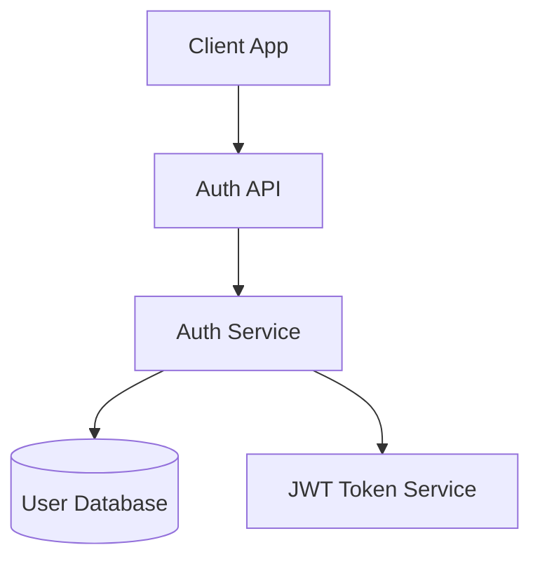

# SpecMind Constitution

This document defines the core architectural decisions, principles, and constraints for the SpecMind project. All code, features, and decisions must align with this constitution.

**Last Updated:** 2025-10-18
**Version:** 1.5.0

## Changelog
- **v1.5.0** (2025-10-18): Renamed `/init` to `/analyze` to avoid conflicts. Setup command now inlines `_shared` prompt templates into slash command files for self-contained distribution. Updated VS Code extension to use esbuild bundling.
- **v1.4.0** (2025-10-18): Standardized testing structure - all packages use `src/__tests__/` for test files, vitest v3.2.4+, 80%+ coverage requirement. Added comprehensive testing guidelines in Section 6.4.
- **v1.3.0** (2025-10-16): Added README sync rule - all user-facing changes in CONSTITUTION.md must be reflected in README.md. Created comprehensive README aligned with constitution.
- **v1.2.0** (2025-10-16): Defined file naming convention - `system.sm` for root, kebab-case slugified names for features. No timestamps in filenames, git history for versioning.
- **v1.1.0** (2025-10-16): Updated .sm file format to include both markdown documentation and architecture diagrams (not just diagrams). Added file organization structure and one-file-per-feature principle.
- **v1.0.0** (2025-10-16): Initial constitution established

---

## 1. Project Vision

**Mission:** Create a developer experience where architecture evolves with code, not after it — turning every feature into a visual, validated, and optimized design.

**Core Workflow:** Spec-driven vibe coding where architecture and implementation stay in sync from the very first commit.

---

## 2. Architectural Decisions

### 2.1 Monorepo Structure

**Decision:** Single monorepo containing all packages (core, format, CLI, VS Code extension)

**Rationale:**
- Shared code reuse (especially .sm format parser/renderer)
- Version synchronization across packages
- Atomic updates when format evolves
- Single place for issues and contributions
- Easier coordination of breaking changes

**Tool:** pnpm workspaces

### 2.2 Programming Language

**Decision:** Full TypeScript stack for all packages

**Rationale:**
- VS Code extension requires TypeScript/JavaScript
- Single language simplifies contributions and maintenance
- Excellent ecosystem for LLM integration (@anthropic-ai/sdk, openai)
- Type sharing across all packages
- Simple distribution (single npm install)
- Great developer experience with modern tooling

**Stack:**
- TypeScript 5.x+
- Node.js 20+ runtime
- ES Modules (ESM)

### 2.3 Code Analysis & Parsing

**Decision:** Use tree-sitter for all code analysis and parsing

**Rationale:**
- Multi-language support (50+ languages) out of the box
- Same parser VS Code uses - battle-tested and fast
- Incremental parsing for performance
- Excellent TypeScript bindings
- Can parse files, classes, modules, functions, and extract relationships
- Unified approach across all supported languages

**Analysis Capabilities:**
- Extract all files, classes, modules, functions
- Identify relationships and dependencies between components
- Build component graphs
- Support for TypeScript, Python, Go, Rust, Java, and more

---

## 3. Package Architecture

### 3.1 Package Boundaries

```
specmind/
├── assistants/         # AI assistant integrations
│   ├── _shared/        # Shared prompt templates (inlined during setup)
│   │   ├── analyze.md
│   │   ├── design.md
│   │   └── implement.md
│   ├── claude-code/
│   ├── cursor/
│   ├── windsurf/
│   └── copilot/
├── packages/
│   ├── core/       # @specmind/core - Pure analysis logic
│   ├── format/     # @specmind/format - .sm file format
│   ├── cli/        # specmind - CLI wrapper + setup command
│   └── vscode/     # VS Code extension (viewer only)
```

### 3.2 Package Responsibilities

#### @specmind/core
- Code analysis using tree-sitter
- Architecture diagram generation
- Architecture diffing
- **Pure library** - no CLI interface, no dependencies on I/O
- Exports clean, typed API

**Key Modules:**
- `analyzer/` - Tree-sitter based code analysis
- `generator/` - Architecture diagram generation
- `differ/` - Architecture diffing logic

#### @specmind/format
- Extract Mermaid diagrams from markdown
- Parse markdown content
- Validate: markdown + at least one Mermaid diagram
- Utilities for rendering
- **No rigid schema** - flexible structure
- **Standalone package** - can be used independently

#### specmind (CLI)
- **Thin wrapper** around `@specmind/core`
- **Two modes:**
  1. **Setup mode** - `npx specmind setup <assistant>` - Copies slash commands to user's project
  2. **Analysis mode** - `npx specmind analyze` - Invoked by AI assistants via bash, outputs JSON
- Commands: `setup`, `analyze`
- Example: `npx specmind analyze --format json`
- Future commands: `diff`, `validate`

#### vscode (VS Code Extension)
- .sm file viewer with visual rendering
- Syntax highlighting for .sm files
- Webview panel for diagram visualization
- **Read-only viewer** - does not execute slash commands

### 3.3 Dependency Rules

```
vscode → format (required for rendering)

cli → core (required)
cli → format (required)

core → format (required for .sm file operations)

format → (no internal dependencies)
```

**Note:**
- Slash commands are self-contained - `setup` inlines `_shared` prompt templates into command files
- When executed by AI assistants, slash commands invoke the CLI via bash commands
- The CLI outputs JSON which the LLM uses to generate documentation

### 3.4 Installation & Setup

**User Installation Flow:**

1. **Install CLI globally** (optional, can use npx)
   ```bash
   npm install -g specmind
   ```

2. **Run setup for your AI assistant**
   ```bash
   # Interactive mode - choose assistant(s)
   npx specmind setup

   # Or specify assistant directly
   npx specmind setup claude-code
   npx specmind setup cursor

   # Or multiple at once
   npx specmind setup claude-code cursor
   ```

3. **Setup command copies files to project:**
   - `claude-code`: Copies `assistants/claude-code/.claude/` → `.claude/`
   - `cursor`: Copies `assistants/cursor/.cursorrules` → `.cursorrules`
   - `windsurf`: Copies `assistants/windsurf/cascade/` → `.cascade/`
   - `copilot`: Copies `assistants/copilot/instructions/` → `.github/copilot/`

4. **Start using slash commands** in your AI assistant

**Prompt Template Architecture:**
- `assistants/_shared/` contains shared prompt logic (single source of truth)
- `assistants/{name}/` contains assistant-specific wrappers that reference shared prompts
- Each assistant folder shows how to integrate prompts into that specific tool

---

## 4. Core Features

### 4.1 Slash Commands

Primary interface for AI coding assistants. Each assistant requires its own slash command implementation.

**Supported AI Assistants:**
- ✅ **Claude Code** - Supported (via `.claude/commands/`)
- 🚧 **Cursor** - Coming Soon (via `.cursorrules` + custom commands)
- 🚧 **Windsurf** - Coming Soon (via Cascade commands)
- 🚧 **GitHub Copilot** - Coming Soon (via `#file` references)

**Core Commands:**

#### `/analyze`
- Slash command that orchestrates system initialization
- LLM executes: `npx specmind analyze --format json`
- CLI wrapper calls `@specmind/core` to analyze codebase with tree-sitter
- Returns JSON containing:
  - Mermaid diagram (architecture visualization)
  - Component metadata (files, classes, functions, relationships)
- LLM receives JSON output and generates markdown documentation (Overview, Requirements, Design Decisions, etc.)
- Creates `.specmind/system.sm` with diagram + documentation
- Creates `.specmind/features/` directory for future feature specs

#### `/design <feature-name>`
- LLM analyzes existing code and user intent for new feature
- Slugifies feature name (e.g., "User Auth" → "user-auth")
- LLM generates feature specification with:
  - Feature overview and requirements (markdown)
  - Proposed architecture diagram (Mermaid)
  - Design decisions and rationale
  - Integration points with existing system
- Proposes architectural diff showing changes to system.sm
- Updates existing feature .sm file if already exists

#### `/implement <feature-name>`
- Reads `.specmind/features/{slugified-name}.sm` for context
- LLM implements code aligned with documented architecture
- Ensures structural and intent alignment
- LLM updates the feature .sm file if implementation diverges from design
- LLM adds notes/warnings to .sm file based on implementation learnings
- Updates system.sm if system-level changes were made

### 4.2 .sm File Format

**Decision:** Feature specification files with .sm extension containing markdown documentation and architecture diagrams

**Format:** Flexible markdown files with embedded Mermaid diagrams

**Core Requirements:**
1. **Markdown** - Any structure, any sections (developers can customize)
2. **At least one Mermaid diagram** - Architecture visualization

**Recommended Structure (not enforced):**

The shared prompts suggest this structure as a best practice, but developers can modify:

1. **Feature Name** (H1 heading: `# Feature Name`)
2. **Overview** - High-level description
3. **Requirements** - Functional/technical requirements
4. **Architecture** - Mermaid diagram(s) showing system structure
5. **Design Decisions** - Rationale and reasoning behind choices
6. **Integration Points** - Connections to other parts
7. **Notes** - Additional context, warnings, optimizations

**Flexibility:**
- Developers can modify prompts to use different sections
- Add custom sections as needed
- Multiple Mermaid diagrams are supported
- No schema validation on section structure

**Example:**
````markdown
# User Authentication

## Overview
Secure user authentication with JWT tokens, supporting email/password and OAuth providers.

## Requirements
- Secure password hashing (bcrypt)
- JWT token generation and validation
- OAuth 2.0 integration
- Session management

## Architecture


## Design Decisions
### Why JWT over sessions?
- Stateless authentication for horizontal scaling
- Better for microservices architecture
- Mobile app support

## Integration Points
- **User Service**: Validates user credentials
- **Email Service**: Sends password reset emails
- **Logging Service**: Audit trail for auth events

## Notes
⚠️ **Security**: Ensure HTTPS in production
💡 **Optimization**: Consider refresh token rotation
````

**Storage Location:** `.specmind/` folder in repository root

**File Organization:**
```
.specmind/
├── system.sm               # Root system architecture (generated by /analyze)
├── features/
│   ├── user-auth.sm       # Feature: User Authentication
│   ├── payment-flow.sm    # Feature: Payment Processing
│   └── analytics-dashboard.sm  # Feature: Analytics Dashboard
└── services/              # (Future: microservices)
    ├── api-gateway.sm
    └── user-service.sm
```

**Naming Convention:**

**Root File:**
- **`system.sm`** - Generated by `/analyze` command
- Contains system-level architecture overview
- Single file per repository

**Feature Files:**
- **Location:** `.specmind/features/{feature-name}.sm`
- **Format:** Kebab-case, lowercase, slugified from feature name
- **Examples:**
  - `"User Authentication"` → `user-authentication.sm`
  - `"Payment Flow"` → `payment-flow.sm`
  - `"Real-time Notifications"` → `real-time-notifications.sm`

**Naming Rules:**
1. Convert to lowercase
2. Replace spaces and special characters with hyphens (`-`)
3. Remove leading/trailing hyphens
4. Use descriptive, meaningful names
5. No timestamps in filename (use git history for versioning)

**File Lifecycle:**
- `/analyze` creates `system.sm`
- `/design "Feature Name"` creates `features/feature-name.sm`
- Subsequent `/design "Feature Name"` updates the same file
- Git history tracks all changes and evolution
- Manual rename if feature name changes significantly

**One .sm file per feature:**
- Each feature gets its own .sm file
- File contains complete context: description + diagram + decisions
- Easy to understand feature architecture at a glance
- Self-documenting - reduces need for external docs
- Traceable evolution through git history

**Features:**
- Human-readable and git-friendly
- Visual rendering in VS Code (markdown + diagram)
- Support for annotations (warnings, optimization tips, duplication alerts)
- Versioned alongside code
- Searchable documentation + architecture in one place
- Can be used in code reviews and design discussions
- Rich context for LLMs when implementing features

---

## 5. User Interfaces

### 5.1 Slash Commands
- Each AI assistant has its own slash command implementation
- Commands invoke `@specmind/core` APIs
- `/analyze`, `/design`, `/implement` commands
- See Section 4.1 for supported assistants

### 5.2 VS Code Extension
- Visual feedback and diagram rendering
- Syntax highlighting for .sm files
- Webview panel for interactive diagrams

---

## 6. Technical Principles

### 6.1 Code Analysis

**Tree-sitter First:**
- All code parsing uses tree-sitter
- Language-specific analyzers extend base analyzer
- Extract: files, classes, modules, functions, imports, exports
- Build relationship graphs between components

**Multi-language Support:**
- TypeScript/JavaScript (via tree-sitter-typescript)
- Python (via tree-sitter-python)
- Go (via tree-sitter-go)
- Rust (via tree-sitter-rust)
- Extensible to 50+ languages

### 6.2 LLM Integration

**Strategy:** Core logic generates prompts, LLMs provide insights

**Supported Providers:**
- Anthropic (Claude)
- OpenAI (GPT-4)
- Extensible to other providers

**Usage:**
- Architecture generation (analyzing component relationships)
- Design suggestions (proposing improvements)
- Code generation (implementing aligned with architecture)

### 6.3 Type Safety

- Zod schemas for runtime validation
- TypeScript types generated from Zod schemas
- Shared types across all packages
- Strict TypeScript configuration

### 6.4 Testing

**Testing Framework:** Vitest (v3.2.4+) for all packages

**Test Organization:**
- **Location:** `src/__tests__/` directory for all test files
- **Naming:** `*.test.ts` for unit tests
- **Coverage:** Minimum 80% code coverage required
- **Fixtures:** `test-fixtures/` directory for realistic test data

**Test Structure:**
```
packages/{package}/
├── src/
│   ├── __tests__/           # All test files here
│   │   ├── parser.test.ts
│   │   ├── utils.test.ts
│   │   └── fixtures/        # Optional test fixtures
│   ├── parser.ts            # Source code
│   └── utils.ts
├── test-fixtures/           # End-to-end test fixtures
└── scripts/
    └── validate-*.mjs       # Validation scripts
```

**Test Types:**
- **Unit tests** (`src/__tests__/*.test.ts`) - Fast, isolated tests for individual functions
- **Integration tests** (`src/__tests__/*.test.ts`) - Test module interactions
- **Fixture validation** (`scripts/validate-*.mjs`) - Real-world scenario tests with actual files

**Coverage Requirements:**
- Lines: 80%+
- Functions: 80%+
- Branches: 80%+
- Statements: 80%+

**Configuration:**
- `vitest.config.ts` in each package
- Exclude `__tests__/`, `test-fixtures/`, and type definitions from coverage
- Use `v8` coverage provider for accuracy

---

## 7. Future Scope

### 7.1 Multi-Service Architectures
- Service-oriented architecture analysis
- Microservice architecture diagrams
- Service interaction optimization
- Client/server and front-end/back-end visualization

### 7.2 GitHub Integration
- Visual architecture diffs in PRs
- Inline notes and optimization feedback
- Architecture review bot
- Breaking change detection

### 7.3 Advanced Analysis
- Performance bottleneck detection
- Code duplication identification
- Security pattern analysis
- Dependency optimization

---

## 8. Non-Negotiables

### 8.1 What We MUST Do

1. **Use tree-sitter** for all code analysis and parsing
2. **Full TypeScript stack** - no mixing languages
3. **Monorepo structure** - all packages in one repo
4. **Slash commands first** - primary user interface
5. **.sm files = markdown + diagrams** - rich feature specifications, not just diagrams
6. **One .sm file per feature** - complete context in single file
7. **Core is pure logic** - no CLI/UI dependencies
8. **Type-safe everything** - Zod + TypeScript
9. **Multi-language support** - not just TypeScript/JavaScript

### 8.2 What We MUST NOT Do

1. **No Python in core logic** - TypeScript only
2. **No tight coupling** between packages - clean boundaries
3. **No breaking .sm format** without migration path
4. **No proprietary formats** - keep everything open and readable
5. **No diagram-only .sm files** - must include markdown documentation
6. **No heavy VS Code dependencies in core** - keep portable
7. **No manual AST parsing** - always use tree-sitter

---

## 9. Development Workflow

### 9.1 Branching Strategy
- `main` - stable releases
- `develop` - integration branch
- Feature branches from `develop`

### 9.2 Release Strategy
- Independent versioning per package
- Changesets for changelog generation
- GitHub Actions for CI/CD
- npm publish for all packages

### 9.3 Documentation
- JSDoc for all public APIs
- README in each package
- Examples in `/examples` folder
- Comprehensive docs in `/docs`

### 9.4 README Sync Rule
**IMPORTANT:** The root README.md must stay aligned with CONSTITUTION.md

**Requirement:** Any major architectural decision added to CONSTITUTION.md must be reflected in README.md if user-facing

**Examples of changes requiring README update:**
- New core features or commands
- Changes to .sm file format
- New technology stack decisions
- Modified workflow or philosophy
- Package structure changes

**Examples NOT requiring README update:**
- Internal implementation details
- Development workflow changes
- Testing strategy updates
- Release process changes

**Process:**
1. Update CONSTITUTION.md first (source of truth)
2. Determine if change is user-facing
3. If yes, update README.md accordingly
4. Both updates should be in same commit/PR

---

## 10. Success Metrics

**Developer Adoption:**
- GitHub stars and forks
- npm downloads
- VS Code extension installs

**Quality Metrics:**
- Test coverage > 80%
- Zero tolerance for type errors
- Performance benchmarks for analysis

**Community:**
- Active contributors
- Issue resolution time
- Documentation quality

---

## Amendment Process

This constitution can be amended when:
1. A significant architectural decision is made
2. A new principle or constraint is established
3. A previous decision is reversed with rationale

All amendments must:
- Be discussed in GitHub issues
- Have clear rationale documented
- Update this document with version bump
- Communicate to contributors

---

**Signatures:**

- **Architecture Owner:** [To be filled]
- **Tech Lead:** [To be filled]
- **Date Established:** 2025-10-16
