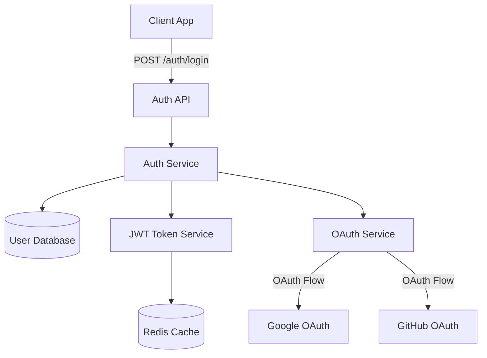

# SpecMind

> Architecture that evolves with your code, not after it.

**SpecMind** is an open-source developer tool for spec-driven vibe coding — a workflow where architecture and implementation stay in sync from the very first commit.

[](https://opensource.org/licenses/MIT)
[](https://www.typescriptlang.org/)
[](https://nodejs.org/)

---

## The Problem

Most development workflows look like this:
1. Write code
2. Ship features
3. (Maybe) update documentation
4. Architecture drifts from reality
5. Onboarding becomes painful
6. Refactoring becomes risky

**What if architecture evolved *with* your code instead?**

---

## The Solution

SpecMind automatically generates, evolves, and validates architecture designs as you build features.

### Core Workflow

```bash
# 1. Initialize - Analyze existing codebase
/init

# 2. Design - Plan new feature architecture
/design "User Authentication"

# 3. Implement - Build with architectural context
/implement "User Authentication"
```

Each feature gets a `.sm` file containing:
- **Overview** - High-level description (markdown)
- **Requirements** - Bullet list of functional/technical requirements
- **Architecture** - Mermaid diagram showing system structure
- **Design Decisions** - Rationale and reasoning behind choices
- **Integration Points** - Bullet list of connections to other parts
- **Notes** - Additional context, warnings, optimizations

---

## Features

### 🎯 Spec-Driven Development
- `/init` - Analyzes your codebase and generates initial architecture
- `/design` - Creates feature specs with diagrams before coding
- `/implement` - Implements code aligned with architecture

### 📊 Architecture as Code
- `.sm` files - Text-based, human-readable specifications
- Markdown + Mermaid.js - Documentation and diagrams in one
- Git-friendly - Version control for your architecture
- One file per feature - Complete context in a single place

### 🔍 Multi-Language Support
- Tree-sitter powered parsing - Supports 50+ languages
- Extract components, relationships, dependencies automatically
- Works with TypeScript, Python, Go, Rust, Java, and more

### 🛠️ Works Everywhere
- **Slash Commands** - Use in Cursor, Windsurf, GitHub Copilot, Claude Code
- **CLI** - Integrate into scripts and CI/CD pipelines
- **VS Code Extension** - Visual diagram rendering and syntax highlighting

---

## Quick Start

> **Note:** SpecMind is currently in active development. Star the repo to follow progress!

### Installation (Coming Soon)

```bash
# Install CLI globally
npm install -g specmind

# Or use with npx
npx specmind init
```

### Basic Usage

```bash
# Initialize your project
specmind init

# Design a new feature
specmind design "Payment Processing"

# Implement the feature (with AI context)
specmind implement "Payment Processing"
```

### Using with AI Assistants

In Cursor, Windsurf, or GitHub Copilot:

```
/init
```

The AI will analyze your codebase and create `.specmind/system.sm` with your architecture.

```
/design "Real-time Notifications"
```

Creates `.specmind/features/real-time-notifications.sm` with:
- Overview and requirements
- Proposed architecture diagram
- Design decisions and rationale
- Integration points
- Notes section for additional context

```
/implement "Real-time Notifications"
```

The AI uses the `.sm` file as context to implement code that aligns with your architecture.

---

## Example .sm File

````markdown
# User Authentication

## Overview
Implement secure user authentication with JWT tokens, supporting email/password
and OAuth providers (Google, GitHub).

## Requirements
- Secure password hashing (bcrypt)
- JWT token generation and validation
- OAuth 2.0 integration
- Session management
- Password reset flow

## Architecture


## Design Decisions

### Why JWT over sessions?
- Stateless authentication for horizontal scaling
- Better for microservices architecture
- Mobile app support

### Why Redis for token blacklist?
- Fast lookup for revoked tokens
- Automatic expiration (TTL)
- Scalable for high traffic

## Integration Points
- **User Service**: Validates user credentials
- **Email Service**: Sends password reset emails
- **Logging Service**: Audit trail for auth events

## Notes
⚠️ **Security**: Ensure HTTPS in production
💡 **Optimization**: Consider refresh token rotation
````

---

## Project Structure

```
.specmind/
├── system.sm                    # Root system architecture
├── features/
│   ├── user-auth.sm
│   ├── payment-flow.sm
│   └── real-time-notifications.sm
└── services/                    # (Future: microservices)
    ├── api-gateway.sm
    └── user-service.sm
```

---

## Architecture

SpecMind is built as a TypeScript monorepo with clear package boundaries:

```
specmind/
├── packages/
│   ├── core/       # @specmind/core - Analysis engine (✅ Implemented)
│   ├── format/     # @specmind/format - .sm file parser (✅ Implemented)
│   ├── cli/        # specmind - CLI tool (🚧 Planned)
│   └── vscode/     # VS Code extension (✅ Published)
```

### Technology Stack
- **Language**: TypeScript 5.x
- **Runtime**: Node.js 20+
- **Parser**: Tree-sitter (multi-language AST)
- **Diagrams**: Mermaid.js
- **Monorepo**: pnpm workspaces
- **Validation**: Zod schemas

See [CONSTITUTION.md](./CONSTITUTION.md) for detailed architectural decisions.

---

## Roadmap

### Phase 1: Core Foundation (Current)
- [x] Project structure and constitution
- [x] Tree-sitter integration (@specmind/core)
- [x] .sm file format parser (@specmind/format)
- [x] VS Code extension (syntax highlighting + preview)
- [ ] Basic CLI commands (`init`, `design`)
- [ ] Architecture diagram generation

### Phase 2: AI Integration
- [ ] Slash commands for AI assistants
- [ ] LLM-powered architecture generation
- [ ] Intelligent diagram updates
- [ ] Code alignment validation

### Phase 3: Advanced Features
- [ ] Multi-service architecture support
- [ ] GitHub PR integration
- [ ] Architecture diff visualization
- [ ] Performance and security analysis

### Phase 4: Community & Ecosystem
- [ ] Plugin system
- [ ] Custom diagram types
- [ ] Architecture templates
- [ ] Community gallery

---

## Contributing

We welcome contributions! SpecMind is built in the open, and we'd love your help.

### Getting Started

1. **Read the [CONSTITUTION.md](./CONSTITUTION.md)** - Understand our architectural principles
2. **Check open issues** - Find something to work on
3. **Join discussions** - Share ideas and feedback

### Development Setup (Coming Soon)

```bash
# Clone the repo
git clone https://github.com/yourusername/specmind.git
cd specmind

# Install dependencies
pnpm install

# Build all packages
pnpm build

# Run tests
pnpm test
```

### Contribution Guidelines

- All code must align with [CONSTITUTION.md](./CONSTITUTION.md)
- Write tests for new features
- Update documentation
- Follow TypeScript best practices
- Keep PRs focused and atomic

---

## Philosophy

### Spec-Driven Vibe Coding

Traditional workflows:
```
Code → (Maybe) Docs → (Eventually) Architecture Diagrams
```

SpecMind workflow:
```
Architecture Spec → Implementation → Validated Architecture
```

### Core Principles

1. **Architecture evolves with code** - Not after, not separately
2. **Text-based everything** - Git-friendly, searchable, composable
3. **One feature, one file** - Complete context in a single .sm file
4. **AI-augmented, not AI-dependent** - Works with or without AI
5. **Multi-language from day one** - No language lock-in

See [CONSTITUTION.md](./CONSTITUTION.md) for our complete philosophy and principles.

---

## FAQ

### How is this different from C4 diagrams or PlantUML?

SpecMind is **workflow-first**, not just diagramming. It:
- Automatically generates diagrams from code
- Keeps architecture in sync with implementation
- Integrates with AI coding assistants
- Combines documentation + diagrams in one file

### Do I need AI to use SpecMind?

No! SpecMind CLI works standalone. AI assistants make it more powerful, but they're optional.

### What languages are supported?

Any language with a tree-sitter grammar (50+ languages including TypeScript, Python, Go, Rust, Java, C++, etc.)

### Can I use this with existing projects?

Yes! `/init` analyzes your existing codebase and generates the initial architecture.

### Is this only for web apps?

No! SpecMind works for any software project - web, mobile, backend, CLI tools, libraries, etc.

---

## License

MIT License - see [LICENSE](./LICENSE) for details.

---

## Acknowledgments

Built with:
- [Tree-sitter](https://tree-sitter.github.io/tree-sitter/) - Incremental parsing
- [Mermaid.js](https://mermaid.js.org/) - Diagram rendering
- [Zod](https://zod.dev/) - Schema validation

---

## Connect

- **GitHub Issues**: [Report bugs or request features](https://github.com/yourusername/specmind/issues)
- **Discussions**: [Share ideas and get help](https://github.com/yourusername/specmind/discussions)
- **Twitter**: Follow updates [@specmind](https://twitter.com/specmind) (coming soon)

---

**Made with ❤️ by developers who believe architecture should evolve with code.**

⭐ Star this repo to follow our progress!
