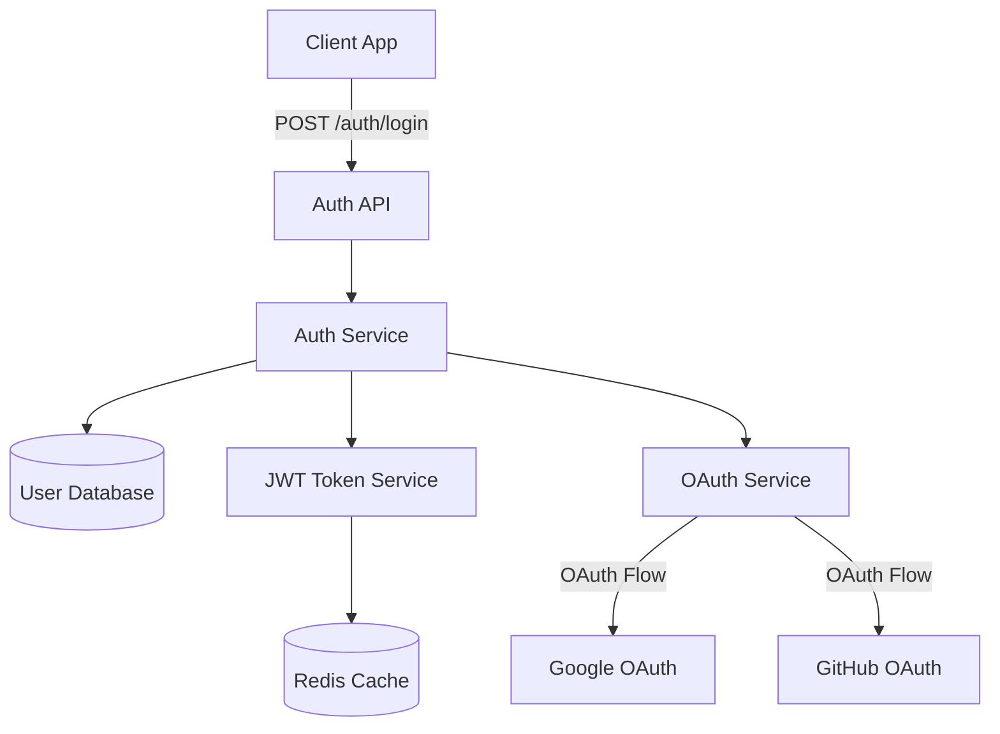

# SpecMind

> Architecture that evolves with your code, not after it.

**SpecMind** is an open-source developer tool for spec-driven vibe coding — a workflow where architecture and implementation stay in sync from the very first commit.

[](https://github.com/specmind/specmind/actions/workflows/test.yml)
[](https://opensource.org/licenses/MIT)
[](https://www.typescriptlang.org/)
[](https://nodejs.org/)

---

## The Problem

**Vibe coding is becoming the default.** AI assistants help developers ship features faster than ever. But this creates new challenges:

- **Conflicting architectures:** Each team member can generate code with different patterns
- **Design in isolation:** Developers create their own solutions without alignment
- **Review difficulty:** Hard to review AI-generated code directly
- **Rapid inconsistency:** Architectural drift compounds with every AI-generated feature
- **No shared vision:** Without specs, codebases become patchworks of individual decisions

**The real solution:** Review architecture/design *first* (before implementation), then ensure the code follows it.

**SpecMind enables this:** Spec-driven vibe coding where architecture evolves *with* your code, maintaining consistency across your team.

---

## The Solution

SpecMind automatically generates, evolves, and validates architecture designs as you build features.

### Core Workflow

```bash
# 1. Initialize - Analyze existing codebase
/analyze

# 2. Design - Plan new feature architecture
/design "User Authentication"

# 3. Implement - Build with architectural context
/implement "User Authentication"
```

Each feature gets a `.sm` file containing:
- **Markdown documentation** - Any structure you want (customize as needed)
- **Two Mermaid diagrams** - Architecture visualization:
  1. Component/Dependency graph (structural view)
  2. Sequence diagram (behavioral/flow view)

The default prompts suggest sections like Overview, Requirements, Architecture, Design Decisions, Integration Points, and Notes - but you can customize these to fit your workflow.

---

## Features

### 🎯 Spec-Driven Development
- `/analyze` - Analyzes your codebase and generates initial architecture
- `/design` - Creates feature specs with diagrams before coding
- `/implement` - Implements code aligned with architecture

### 📊 Architecture as Code
- `.sm` files - Text-based, human-readable specifications
- Markdown + Mermaid.js - Documentation and diagrams in one
- Git-friendly - Version control for your architecture
- One file per feature - Complete context in a single place
- Flexible structure - Customize sections to fit your needs

### 🔍 Code Analysis
- Tree-sitter powered parsing - Fast and accurate
- Extract components, relationships, dependencies automatically
- Currently supports TypeScript and JavaScript (more languages coming soon)

---

## Quick Start

> **Note:** SpecMind is currently in active development. Star the repo to follow progress!

> **Requirements:** Currently supports **Claude Code**. Support for Cursor, Windsurf, and GitHub Copilot coming soon.

### Installation

**Step 1: Setup SpecMind for your AI assistant**

```bash
# Quick setup with npx (recommended)
npx specmind setup claude-code

# Or interactive mode - choose your assistant(s)
npx specmind setup

# Or install globally first
npm install -g specmind
specmind setup claude-code
```

This copies the slash command files to your project (e.g., `.claude/commands/` for Claude Code).

**Step 2: Install VS Code extension (optional)**

Search "SpecMind" in VS Code extensions marketplace for visual .sm file rendering.

### Using Slash Commands

In Claude Code:

```
/analyze
```

The AI will analyze your codebase and create `.specmind/system.sm` with your architecture.

```
/design "Real-time Notifications"
```

Creates `.specmind/features/real-time-notifications.sm` with:
- Overview and requirements
- **Two architecture diagrams** showing system with feature integrated:
  - Component/Dependency graph (with color-coded changes)
  - Sequence diagram (showing feature flow through system)
- Architectural impact analysis (what's added/modified/removed)
- Design decisions and rationale
- Integration points
- Notes section for additional context

```
/implement "Real-time Notifications"
```

The AI uses the `.sm` file as context to implement code that aligns with your architecture.

---

## Supported AI Assistants

SpecMind uses slash commands that are specific to each AI coding assistant. Here's our current support status:

| AI Assistant | Status | Implementation Method | Commands |
|--------------|--------|----------------------|----------|
| **Claude Code** | ✅ Supported | `.claude/commands/` invoking `npx specmind` | `/analyze`, `/design`, `/implement` |
| **Cursor** | 🚧 Coming Soon | `.cursorrules` + bash invocation | Planned |
| **Windsurf** | 🚧 Coming Soon | Cascade commands + bash invocation | Planned |
| **GitHub Copilot** | 🚧 Coming Soon | Custom prompts + bash invocation | Planned |

Each AI assistant requires its own slash command implementation, but all invoke the same `specmind` CLI wrapper which outputs JSON for the LLM to process.

---

## Language Support

SpecMind uses tree-sitter for code analysis, enabling support for multiple programming languages:

| Language | Status | Notes |
|----------|--------|-------|
| **TypeScript** | ✅ Supported | Full support for TS/TSX files |
| **JavaScript** | ✅ Supported | Full support for JS/JSX files |
| **Python** | 🚧 Planned | Next priority |
| **Go** | 🚧 Planned | Coming soon |
| **Rust** | 🚧 Planned | Coming soon |
| **Java** | 🚧 Planned | Coming soon |
| **C++** | 🚧 Planned | Coming soon |

Tree-sitter supports 50+ languages, so additional language support can be added based on community demand.

---

## Example .sm File

Here's an example using the recommended structure (you can customize this):

````markdown
# User Authentication

## Overview
Implement secure user authentication with JWT tokens, supporting email/password
and OAuth providers (Google, GitHub).

## Requirements
- Secure password hashing (bcrypt)
- JWT token generation and validation
- OAuth 2.0 integration
- Session management
- Password reset flow

## Architecture


## Design Decisions

### Why JWT over sessions?
- Stateless authentication for horizontal scaling
- Better for microservices architecture
- Mobile app support

### Why Redis for token blacklist?
- Fast lookup for revoked tokens
- Automatic expiration (TTL)
- Scalable for high traffic

## Integration Points
- **User Service**: Validates user credentials
- **Email Service**: Sends password reset emails
- **Logging Service**: Audit trail for auth events

## Notes
⚠️ **Security**: Ensure HTTPS in production
💡 **Optimization**: Consider refresh token rotation
````

> **Note:** This structure is just a suggestion. You can modify the prompts in `assistants/_shared/` to use different sections or formats.

---

## Project Structure

```
.specmind/
├── system.sm                    # Root system architecture
├── features/
│   ├── user-auth.sm
│   ├── payment-flow.sm
│   └── real-time-notifications.sm
└── services/                    # (Future: microservices)
    ├── api-gateway.sm
    └── user-service.sm
```

---

## Architecture

SpecMind is built as a TypeScript monorepo with clear package boundaries:

```
specmind/
├── assistants/     # AI assistant integrations
│   ├── _shared/    # Shared prompt templates (✅ Implemented)
│   ├── claude-code/  # Claude Code integration (✅ Implemented)
│   ├── cursor/       # Cursor integration (🚧 Planned)
│   ├── windsurf/     # Windsurf integration (🚧 Planned)
│   └── copilot/      # Copilot integration (🚧 Planned)
├── packages/
│   ├── core/       # @specmind/core - Analysis engine (✅ Implemented)
│   ├── format/     # @specmind/format - .sm file parser (✅ Implemented)
│   ├── cli/        # specmind - CLI wrapper + setup (✅ Implemented)
│   └── vscode/     # VS Code extension (✅ Published)
```

### Technology Stack
- **Language**: TypeScript 5.x
- **Runtime**: Node.js 20+
- **Parser**: Tree-sitter (multi-language AST)
- **Diagrams**: Mermaid.js
- **Monorepo**: pnpm workspaces
- **Validation**: Zod schemas

See [CONSTITUTION.md](./CONSTITUTION.md) for detailed architectural decisions.

---

## Roadmap

### Phase 1: Core Foundation (Current)
- [x] Project structure and constitution
- [x] Tree-sitter integration (@specmind/core)
- [x] .sm file format parser (@specmind/format)
- [x] VS Code extension (syntax highlighting + preview)
- [x] Slash commands for AI assistants
- [x] Architecture diagram generation
- [x] LLM-powered documentation generation
- [ ] Code alignment validation

### Phase 2: Advanced Features
- [ ] Multi-service architecture support
- [ ] GitHub PR integration
- [ ] Architecture diff visualization
- [ ] Performance and security analysis

### Phase 3: Community & Ecosystem
- [ ] Plugin system
- [ ] Custom diagram types
- [ ] Architecture templates
- [ ] Community gallery

---

## Contributing

We welcome contributions! SpecMind is built in the open, and we'd love your help.

### Getting Started

1. **Read the [CONSTITUTION.md](./CONSTITUTION.md)** - Understand our architectural principles
2. **Check open issues** - Find something to work on
3. **Join discussions** - Share ideas and feedback

### Development Setup

```bash
# Clone the repo
git clone https://github.com/specmind/specmind.git
cd specmind

# Install dependencies
pnpm install

# Build all packages
pnpm build

# Run tests
pnpm test

# Link CLI globally for local development
cd packages/cli
pnpm link --global
```

### Contribution Guidelines

- All code must align with [CONSTITUTION.md](./CONSTITUTION.md)
- Write tests for new features
- Update documentation
- Follow TypeScript best practices
- Keep PRs focused and atomic

---

## Philosophy

### Spec-Driven Vibe Coding

Traditional workflows:
```
Code → (Maybe) Docs → (Eventually) Architecture Diagrams
```

SpecMind workflow:
```
Architecture Spec → Implementation → Validated Architecture
```

### Core Principles

1. **Architecture evolves with code** - Not after, not separately
2. **Text-based everything** - Git-friendly, searchable, composable
3. **One feature, one file** - Complete context in a single .sm file
4. **AI-powered by design** - LLM generates documentation, tree-sitter analyzes code
5. **Extensible language support** - Built on tree-sitter for future multi-language support

See [CONSTITUTION.md](./CONSTITUTION.md) for our complete philosophy and principles.

---

## FAQ

### How is this different from C4 diagrams or PlantUML?

SpecMind is **workflow-first**, not just diagramming. It:
- Automatically generates diagrams from code
- Keeps architecture in sync with implementation
- Integrates with AI coding assistants
- Combines documentation + diagrams in one file

### Do I need AI to use SpecMind?

Yes! SpecMind is AI-powered by design. All three slash commands (`/analyze`, `/design`, `/implement`) are LLM-powered and work by invoking the `specmind` CLI to get code analysis data (via tree-sitter), then use that data to generate documentation and diagrams.

### Can I use this with existing projects?

Yes! `/analyze` analyzes your existing codebase and generates the initial architecture.

### Is this only for web apps?

No! SpecMind works for any software project - web, mobile, backend, CLI tools, libraries, etc.

---

## License

MIT License - see [LICENSE](./LICENSE) for details.

---

## Acknowledgments

Built with:
- [Tree-sitter](https://tree-sitter.github.io/tree-sitter/) - Incremental parsing
- [Mermaid.js](https://mermaid.js.org/) - Diagram rendering
- [Zod](https://zod.dev/) - Schema validation

---

## Connect

- **GitHub Issues**: [Report bugs or request features](https://github.com/specmind/specmind/issues)
- **Discussions**: [Share ideas and get help](https://github.com/specmind/specmind/discussions)
- **Twitter**: Follow updates [@specmind](https://twitter.com/specmindai) (coming soon)

---

**Made with ❤️ by developers who believe architecture should evolve with code.**

⭐ Star this repo to follow our progress!
