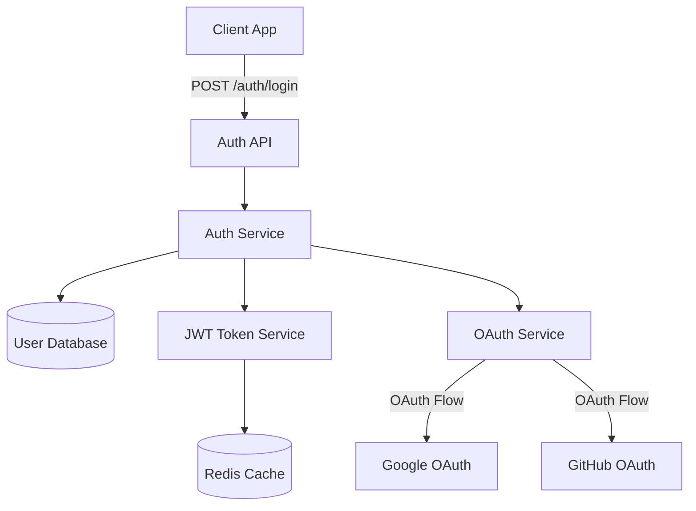
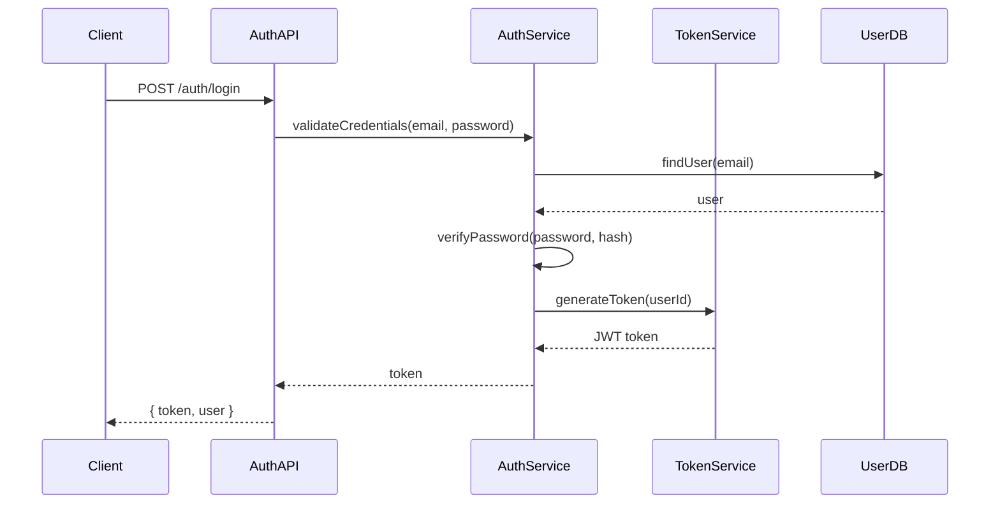

# SpecMind

> Architecture that evolves with your code, not after it.

**SpecMind** is an open-source developer tool for spec-driven vibe coding — a workflow where architecture and implementation stay in sync from the very first commit.

[](https://github.com/specmind/specmind/actions/workflows/test.yml)
[](https://opensource.org/licenses/MIT)
[](https://www.typescriptlang.org/)
[](https://nodejs.org/)

---

## The Problem

**Vibe coding is becoming the default.** AI assistants help developers ship features faster than ever. But this creates new challenges:

- **Conflicting architectures:** Each team member can generate code with different patterns
- **Design in isolation:** Developers create their own solutions without alignment
- **Review difficulty:** Hard to review AI-generated code directly
- **Rapid inconsistency:** Architectural drift compounds with every AI-generated feature
- **No shared vision:** Without specs, codebases become patchworks of individual decisions

**The real solution:** Review architecture/design *first* (before implementation), then ensure the code follows it.

**SpecMind enables this:** Spec-driven vibe coding where architecture evolves *with* your code, maintaining consistency across your team.

---

## The Solution

SpecMind automatically generates, evolves, and validates architecture designs as you build features.

### Core Workflow

**1. `/analyze` - Understand your system**

Analyzes your codebase and generates **`.specmind/system.sm`** containing:
- System-wide architecture diagram (services, databases, external integrations)
- Cross-service flow diagrams (sequence diagrams showing request/response cycles)
- Per-service architecture diagrams (classes/methods organized by layer)
- Technology stack and architecture violations

**2. `/design <feature>` - Plan before you code**

Creates **`.specmind/features/{feature-name}.sm`** showing how the feature will update your system:
- Overview, Requirements, and Design Decisions
- System Architecture Updates (new/modified/removed services with color-coded changes)
- Cross-Service Flows Updates (new or modified sequence diagrams)
- Service Architecture Updates (affected classes/methods by layer)
- Integration Points and Summary

**3. `/implement <feature>` - Build with context**

Implements the feature following its `.sm` specification, then:
- Updates **`.specmind/system.sm`** with actual changes (removes color coding)
- Updates the feature `.sm` file if implementation diverged from design
- Appends entry to **`.specmind/system.changelog`** documenting what changed

All `.sm` files use Markdown + Mermaid diagrams and can be viewed with the SpecMind VS Code extension.

---

## Quick Start

> **Note:** SpecMind is currently in active development. Star the repo to follow progress!

> **Requirements:** Currently supports **Claude Code** and **Windsurf**. Support for Cursor and GitHub Copilot coming soon.

### Installation

**Step 1: Setup SpecMind for your AI assistant**

```bash
# For Claude Code
npx specmind setup claude-code

# For Windsurf
npx specmind setup windsurf

# Or interactive mode - choose your assistant(s)
npx specmind setup

# Or install globally first
npm install -g specmind
specmind setup claude-code  # or windsurf
```

This copies the assistant files to your project:
- Claude Code: `.claude/commands/` (slash commands)
- Windsurf: `.windsurf/workflows/` (Cascade workflows)

**Step 2: Install VS Code extension (optional)**

Search "SpecMind" in VS Code extensions marketplace for visual .sm file rendering.

### Using Commands

**In Claude Code** (slash commands):

```
/analyze
```

**In Windsurf** (slash commands):

```
/analyze
```

The AI will analyze your codebase and create `.specmind/system.sm` with your architecture.

**Design a feature:**

Claude Code:
```
/design Real-time Notifications
```

Windsurf:
```
/design Real-time Notifications
```

You can provide either:
- A short name: `Real-time Notifications`
- Or a detailed description: `Real-time notification system using WebSockets for live updates and push events`

The AI will extract the feature name and create a slugified filename.

Creates `.specmind/features/real-time-notifications.sm` with:
- Overview and requirements
- **Two architecture diagrams** showing system with feature integrated:
  - Component/Dependency graph (with color-coded changes)
  - Sequence diagram (showing feature flow through system)
- Architectural impact analysis (what's added/modified/removed)
- Design decisions and rationale
- Integration points
- Notes section for additional context

**Implement the feature:**

Claude Code:
```
/implement Real-time Notifications
```

Windsurf:
```
/implement Real-time Notifications
```

The AI uses the `.sm` file as context to implement code that aligns with your architecture.

---

## Supported AI Assistants

SpecMind uses slash commands that are specific to each AI coding assistant. Here's our current support status:

| AI Assistant | Status | Implementation Method | Commands |
|--------------|--------|----------------------|----------|
| **Claude Code** | ✅ Supported | `.claude/commands/` invoking `npx specmind` | `/analyze`, `/design`, `/implement` |
| **Windsurf** | ✅ Supported | `.windsurf/workflows/` Cascade workflows with shared prompts | `/analyze`, `/design`, `/implement` |
| **Cursor** | 🚧 Coming Soon | `.cursorrules` + bash invocation | Planned |
| **GitHub Copilot** | 🚧 Coming Soon | Custom prompts + bash invocation | Planned |

Each AI assistant requires its own implementation method, but all use the same shared prompt templates for consistency.

---

## Language Support

SpecMind uses tree-sitter for code analysis, enabling support for multiple programming languages:

| Language | Status | Notes |
|----------|--------|-------|
| **TypeScript** | ✅ Supported | Full support for TS/TSX files |
| **JavaScript** | ✅ Supported | Full support for JS/JSX files |
| **Python** | ✅ Supported | Full support for .py/.pyi files |
| **C#** | 🚧 Planned | Coming soon |
| **Go** | 🚧 Planned | Coming soon |
| **Rust** | 🚧 Planned | Coming soon |
| **Java** | 🚧 Planned | Coming soon |
| **C++** | 🚧 Planned | Coming soon |

Tree-sitter supports 50+ languages, so additional language support can be added based on community demand.

---

## File Exclusions

SpecMind respects your project's `.gitignore` file to automatically exclude files and directories from analysis.

### `.gitignore` Support

When running `/analyze`, SpecMind automatically:
- Loads all `.gitignore` files from the analysis directory up to the repository root
- Excludes files and directories matching gitignore patterns
- Supports all gitignore syntax (wildcards, negation, directory patterns, etc.)

This means build outputs (`dist/`, `node_modules/`), environment files (`.env`), and other ignored files are automatically excluded from analysis.

### `.specmindignore`

For files you want in git but not in architecture analysis, create a `.specmindignore` file in your project root:

```gitignore
# Exclude test fixtures
fixtures/
__mocks__/

# Exclude example code
examples/
*.example.ts

# Exclude generated documentation
docs/api/

# Exclude specific files
scripts/legacy-migration.ts
```

**Use cases for `.specmindignore`:**
- Test fixtures and mock data that should be in git but not analyzed
- Example code that demonstrates usage but isn't part of the architecture
- Generated documentation or API specs
- Legacy migration scripts
- Temporary experimental code

Both `.gitignore` and `.specmindignore` patterns are combined, so you get precise control over what's analyzed.

---

## Example .sm File

Here's an example using the recommended structure (you can customize this):

````markdown
# User Authentication

## Overview
Implement secure user authentication with JWT tokens, supporting email/password
and OAuth providers (Google, GitHub).

## Requirements
- Secure password hashing (bcrypt)
- JWT token generation and validation
- OAuth 2.0 integration
- Session management
- Password reset flow

## Architecture

### Component Diagram


### Sequence Diagram


## Design Decisions

### Why JWT over sessions?
- Stateless authentication for horizontal scaling
- Better for microservices architecture
- Mobile app support

### Why Redis for token blacklist?
- Fast lookup for revoked tokens
- Automatic expiration (TTL)
- Scalable for high traffic

## Integration Points
- **User Service**: Validates user credentials
- **Email Service**: Sends password reset emails
- **Logging Service**: Audit trail for auth events

## Notes
⚠️ **Security**: Ensure HTTPS in production
💡 **Optimization**: Consider refresh token rotation
````

> **Note:** This structure is just a suggestion. You can modify the prompts in `assistants/_shared/` to use different sections or formats.

### Rendered Diagrams

Here's how the diagrams above render visually:

#### Component Diagram


#### Sequence Diagram


> **💡 Tip:** To view `.sm` files with rendered diagrams in VS Code, install the **SpecMind** extension:
> 1. Open VS Code
> 2. Go to Extensions (Ctrl+Shift+X / Cmd+Shift+X)
> 3. Search for "SpecMind"
> 4. Click Install
> 5. Open any `.sm` file and click the preview icon or press `Ctrl+K V` (Cmd+K V on Mac)

---

## Project Structure

### Current Structure

For large codebases, SpecMind automatically splits analysis into services and layers with chunking:

```
.specmind/
├── system.sm                    # AI-generated system architecture documentation
├── features/                    # Feature specifications
│   ├── user-auth.sm
│   └── payment-flow.sm
└── system/                      # Split analysis output (chunked)
    ├── metadata.json            # Root metadata with cross-service dependencies
    └── services/                # Per-service layer analysis
        ├── api-gateway/
        │   ├── metadata.json        # Service metadata with cross-layer dependencies
        │   ├── data-layer/
        │   │   ├── summary.json # Layer summary (pretty-printed, <50KB)
        │   │   ├── chunk-0.json # File analysis (minified, ~20K tokens)
        │   │   └── chunk-1.json # Additional chunks as needed
        │   ├── api-layer/
        │   │   ├── summary.json
        │   │   └── chunk-0.json
        │   ├── service-layer/
        │   │   └── ...
        │   └── external-layer/
        │       └── ...
        └── worker-service/
            ├── metadata.json
            └── ...
```

**Benefits:**
- Chunked files (~20K tokens, ~80KB) fit within LLM context windows (well under 25K limit)
- **AI-generated system.sm** with three diagram types:
  - System Architecture - Global view with brand colors for databases/external services
  - Per-Service Architecture - One diagram per service showing all classes/methods by layer
  - Cross-Service Flows - Sequence diagrams showing complete request/response cycles
- Summary files provide quick layer overview without loading full data
- Organized by architectural concerns (data/api/service/external)
- Supports both monorepo (multiple services) and monolith (single service)
- Three-level dependency hierarchy (cross-service, cross-layer, same-layer)
- Detects 180+ frameworks, ORMs, databases, and SDKs
- Minified chunks maximize data density while keeping summaries readable
- Token-based chunking ensures all chunks can be read by AI without hitting context limits

See [ANALYSIS_SPLIT_SPEC.md](./docs/ANALYSIS_SPLIT_SPEC.md) for the complete specification.

---

## Architecture

SpecMind is built as a TypeScript monorepo with clear package boundaries:

```
specmind/
├── assistants/     # AI assistant integrations
│   ├── _shared/    # Shared prompt templates (✅ Implemented)
│   ├── claude-code/  # Claude Code integration (✅ Implemented)
│   ├── cursor/       # Cursor integration (🚧 Planned)
│   ├── windsurf/     # Windsurf integration (🚧 Planned)
│   └── copilot/      # Copilot integration (🚧 Planned)
├── packages/
│   ├── core/       # @specmind/core - Analysis engine (✅ Implemented)
│   ├── format/     # @specmind/format - .sm file parser (✅ Implemented)
│   ├── cli/        # specmind - CLI wrapper + setup (✅ Implemented)
│   └── vscode/     # VS Code extension (✅ Published)
```

### Technology Stack
- **Language**: TypeScript 5.x
- **Runtime**: Node.js 20+
- **Parser**: Tree-sitter (multi-language AST)
- **Diagrams**: Mermaid.js
- **Monorepo**: pnpm workspaces
- **Validation**: Zod schemas

See [CONSTITUTION.md](./CONSTITUTION.md) for detailed architectural decisions.

---

## Roadmap

### Phase 1: Core Foundation (✅ Complete)
- [x] Project structure and constitution
- [x] Tree-sitter integration (@specmind/core)
- [x] .sm file format parser (@specmind/format)
- [x] VS Code extension (syntax highlighting + preview)
- [x] Slash commands for AI assistants
- [x] AI-generated architecture diagrams (System, Per-Service, Cross-Service Flows)
- [x] LLM-powered documentation generation
- [x] TypeScript, JavaScript, Python language support
- [x] CLI integration

### Phase 2: Split Analysis Architecture (✅ Complete)
- [x] Split analysis architecture
- [x] Service detection (monorepo/monolith)
- [x] Layer categorization (data/api/service/external)
- [x] Pattern-based detection with JSON configs (180+ packages/tools)
- [x] Cross-layer dependency tracking
- [x] Database type detection (PostgreSQL, MySQL, Redis, MongoDB)
- [x] API endpoint extraction (32 frameworks)
- [x] Message queue detection (RabbitMQ, Kafka, SQS, etc.)

### Phase 3: Advanced Features
- [ ] Code alignment validation
- [ ] GitHub PR integration
- [ ] Architecture diff visualization
- [ ] Performance and security analysis
- [ ] Additional language support (Go, Rust, Java, C#, PHP, Ruby)

### Phase 4: Community & Ecosystem
- [ ] Plugin system
- [ ] Custom diagram types
- [ ] Architecture templates
- [ ] Community gallery

---

## Contributing

We welcome contributions! SpecMind is built in the open, and we'd love your help.

### Getting Started

1. **Read the [CONSTITUTION.md](./CONSTITUTION.md)** - Understand our architectural principles
2. **Check open issues** - Find something to work on
3. **Join discussions** - Share ideas and feedback

### Development Setup

```bash
# Clone the repo
git clone https://github.com/specmind/specmind.git
cd specmind

# Install dependencies
pnpm install

# Build all packages
pnpm build

# Run tests
pnpm test

# Link CLI globally for local development
cd packages/cli
pnpm link --global
```

### Contribution Guidelines

- All code must align with [CONSTITUTION.md](./CONSTITUTION.md)
- Write tests for new features
- Update documentation
- Follow TypeScript best practices
- Keep PRs focused and atomic

---

## Philosophy

### Spec-Driven Vibe Coding

Traditional workflows:
```
Code → (Maybe) Docs → (Eventually) Architecture Diagrams
```

SpecMind workflow:
```
Architecture Spec → Implementation → Validated Architecture
```

### Core Principles

1. **Architecture evolves with code** - Not after, not separately
2. **Text-based everything** - Git-friendly, searchable, composable
3. **One feature, one file** - Complete context in a single .sm file
4. **AI-powered by design** - LLM generates documentation, tree-sitter analyzes code
5. **Extensible language support** - Built on tree-sitter for future multi-language support

See [CONSTITUTION.md](./CONSTITUTION.md) for our complete philosophy and principles.

---

## FAQ

### How is this different from C4 diagrams or PlantUML?

SpecMind is **workflow-first**, not just diagramming. It:
- Automatically generates diagrams from code
- Keeps architecture in sync with implementation
- Integrates with AI coding assistants
- Combines documentation + diagrams in one file

### Do I need AI to use SpecMind?

Yes! SpecMind is AI-powered by design. All three slash commands (`/analyze`, `/design`, `/implement`) are LLM-powered and work by invoking the `specmind` CLI to get code analysis data (via tree-sitter), then use that data to generate documentation and diagrams.

### Can I use this with existing projects?

Yes! `/analyze` analyzes your existing codebase and generates the initial architecture.

### Is this only for web apps?

No! SpecMind works for any software project - web, mobile, backend, CLI tools, libraries, etc.

---

## License

MIT License - see [LICENSE](./LICENSE) for details.

---

## Acknowledgments

Built with:
- [Tree-sitter](https://tree-sitter.github.io/tree-sitter/) - Incremental parsing
- [Mermaid.js](https://mermaid.js.org/) - Diagram rendering
- [Zod](https://zod.dev/) - Schema validation

---

## Connect

- **GitHub Issues**: [Report bugs or request features](https://github.com/specmind/specmind/issues)
- **Discussions**: [Share ideas and get help](https://github.com/specmind/specmind/discussions)
- **Twitter**: Follow updates [@specmind](https://twitter.com/specmindai) (coming soon)

---

**Made with ❤️ by developers who believe architecture should evolve with code.**

⭐ Star this repo to follow our progress!
