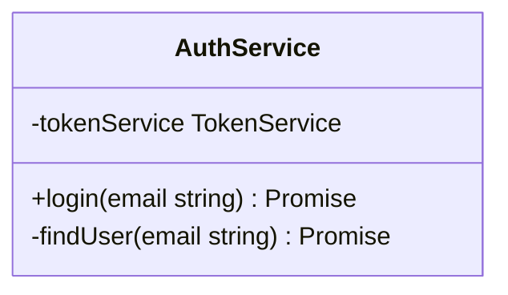
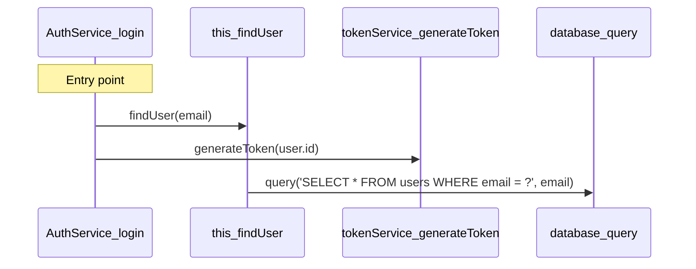

# Code Analysis & Diagram Generation: Deep Dive

> **Technical deep-dive into how SpecMind parses code and generates Mermaid diagrams**

This document focuses specifically on the mechanics of:
1. **Code Parsing & Analysis** - How tree-sitter extracts code elements
2. **Diagram Generation** - How extracted data becomes Mermaid diagrams

---

## Part 1: Code Parsing & Analysis

### What is Tree-Sitter?

**Tree-sitter** is an incremental parsing library that builds **Abstract Syntax Trees (ASTs)** from source code. Unlike regex-based approaches, it provides:

- **Syntax-aware parsing** - Understands language structure
- **Error recovery** - Can parse incomplete/invalid code
- **Incremental updates** - Only reparse changed sections
- **Fast performance** - Written in C, optimized for speed

### AST Structure

An AST represents code as a tree of nodes:

```typescript
// Source Code:
function greet(name: string) {
  return `Hello, ${name}`
}

// AST (simplified):
function_declaration
├── name: identifier("greet")
├── parameters: formal_parameters
│   └── required_parameter
│       ├── pattern: identifier("name")
│       └── type: type_annotation
│           └── predefined_type("string")
└── body: statement_block
    └── return_statement
        └── template_string
```

Each node has:
- `type` - Node type (e.g., "function_declaration")
- `text` - Raw source text
- `children` - Child nodes
- `startPosition` / `endPosition` - Location in source
- `namedChildren` - Only named children (excludes punctuation)

---

## Parsing Process: Step-by-Step

### Step 1: Initialize Parser

```typescript
// packages/core/src/analyzer/parser.ts

import Parser from 'tree-sitter'
import TypeScriptParser from 'tree-sitter-typescript'

// Create parser instance
const parser = new Parser()

// Load TypeScript grammar
parser.setLanguage(TypeScriptParser.typescript)
```

**Key Concept:** Parsers are language-specific. Each grammar knows how to parse that language's syntax.

### Step 2: Parse Source Code

```typescript
const sourceCode = `
export class AuthService {
  async login(email: string): Promise<Token> {
    const user = await this.findUser(email)
    return this.generateToken(user.id)
  }
}
`

// Parse into AST
const tree = parser.parse(sourceCode)

// Access root node
const rootNode = tree.rootNode
console.log(rootNode.type) // "program"
console.log(rootNode.childCount) // 1 (the export statement)
```

### Step 3: Query the AST

Tree-sitter provides a powerful query language to find specific nodes:

```typescript
// Define what we're looking for (like SQL for ASTs)
const query = new Parser.Query(
  parser.getLanguage(),    // TypeScript grammar
  `
    (function_declaration) @func
    (method_definition) @func
    (arrow_function) @func
  `
)
```

**What this does:**
- Searches the AST for nodes of type `function_declaration`, `method_definition`, or `arrow_function`
- Labels each match with `@func` (the capture name)
- Returns ALL matches in one efficient search

**Execute the query:**

```typescript
// Search the entire AST starting from root
const captures = query.captures(tree.rootNode)

// Loop through all matched nodes
for (const capture of captures) {
  const node = capture.node  // The matched AST node
  console.log(node.type)     // "function_declaration" | "method_definition" | "arrow_function"
  console.log(node.text)     // Full source code of that function
}
```

**Example:**

If your code has:
```typescript
function greet() { }      // ← function_declaration
const login = () => { }   // ← arrow_function
class User {
  logout() { }            // ← method_definition
}
```

The query returns:
```typescript
captures = [
  { name: "func", node: <greet function node> },
  { name: "func", node: <login arrow function node> },
  { name: "func", node: <logout method node> }
]
```

**Why queries are better than manual traversal:**
- ✅ **Faster** - Optimized search by tree-sitter
- ✅ **Cleaner** - Pattern matching vs. manual if/else chains
- ✅ **Maintainable** - Easy to add/remove patterns

---

## Extraction Deep Dive

### Function Extraction

Let's extract a function step-by-step:

```typescript
// Source:
export async function login(email: string, password: string): Promise<Token> {
  // implementation
}

// AST node type: "function_declaration"
```

**Step 1: Find Function Nodes**

```typescript
const queryString = `(function_declaration) @function`
const query = new Parser.Query(parser.getLanguage(), queryString)
const captures = query.captures(tree.rootNode)

for (const capture of captures) {
  const node = capture.node // This is our function_declaration node

  // Now extract details...
}
```

**Step 2: Extract Function Name**

```typescript
function extractFunctionName(node: SyntaxNode): string {
  // Function declarations have a 'name' field
  const nameNode = node.childForFieldName('name')
  return nameNode?.text || 'anonymous'
}

const name = extractFunctionName(node)
// Result: "login"
```

**Step 3: Extract Parameters**

```typescript
function extractParameters(node: SyntaxNode): Parameter[] {
  // Get parameters field
  const paramsNode = node.childForFieldName('parameters')
  if (!paramsNode) return []

  const parameters: Parameter[] = []

  // Iterate over parameter nodes
  for (const child of paramsNode.namedChildren) {
    if (child.type === 'required_parameter') {
      // Get parameter name
      const pattern = child.childForFieldName('pattern')
      const name = pattern?.text || 'unknown'

      // Get type annotation
      const typeAnnotation = child.childForFieldName('type')
      const type = typeAnnotation?.text?.replace(/^:\s*/, '') // Remove leading ':'

      parameters.push({ name, type })
    }
  }

  return parameters
}

// Result:
// [
//   { name: "email", type: "string" },
//   { name: "password", type: "string" }
// ]
```

**Step 4: Extract Return Type**

```typescript
function extractReturnType(node: SyntaxNode): string | undefined {
  const returnTypeNode = node.childForFieldName('return_type')
  if (!returnTypeNode) return undefined

  return returnTypeNode.text.replace(/^:\s*/, '')
}

// Result: "Promise<Token>"
```

**Step 5: Check Modifiers**

```typescript
function isExported(node: SyntaxNode): boolean {
  // Walk up the tree to find export_statement parent
  let current: SyntaxNode | null = node.parent

  while (current) {
    if (current.type === 'export_statement') {
      return true
    }
    current = current.parent
  }

  return false
}

function isAsync(node: SyntaxNode): boolean {
  // Look for 'async' keyword in children
  for (const child of node.children) {
    if (child.type === 'async' || child.text === 'async') {
      return true
    }
  }
  return false
}
```

**Step 6: Get Source Location**

```typescript
function createSourceLocation(node: SyntaxNode, filePath: string): SourceLocation {
  return {
    filePath,
    startLine: node.startPosition.row + 1, // Tree-sitter uses 0-indexed
    endLine: node.endPosition.row + 1,
    startColumn: node.startPosition.column,
    endColumn: node.endPosition.column,
  }
}
```

**Final Result:**

```typescript
{
  name: "login",
  qualifiedName: "login",
  parameters: [
    { name: "email", type: "string" },
    { name: "password", type: "string" }
  ],
  returnType: "Promise<Token>",
  isExported: true,
  isAsync: true,
  location: {
    filePath: "auth.ts",
    startLine: 1,
    endLine: 4,
    startColumn: 0,
    endColumn: 1
  }
}
```

---

### Class Extraction

Classes are more complex - they contain methods and properties.

```typescript
// Source:
export class AuthService {
  private tokenService: TokenService

  async login(email: string): Promise<Token> {
    return this.tokenService.generate(email)
  }
}
```

**Step 1: Find Class Node**

```typescript
const queryString = `(class_declaration) @class`
const query = new Parser.Query(parser.getLanguage(), queryString)
const captures = query.captures(tree.rootNode)

const classNode = captures[0].node
```

**Step 2: Extract Class Name**

```typescript
const nameNode = classNode.childForFieldName('name')
const className = nameNode?.text || 'Anonymous'
// Result: "AuthService"
```

**Step 3: Extract Class Body**

```typescript
const bodyNode = classNode.childForFieldName('body')
// bodyNode.type === "class_body"

// Body contains property and method definitions
for (const member of bodyNode.namedChildren) {
  if (member.type === 'public_field_definition') {
    // Extract property
  } else if (member.type === 'method_definition') {
    // Extract method
  }
}
```

**Step 4: Extract Properties**

```typescript
function extractProperties(bodyNode: SyntaxNode, filePath: string): PropertyDefinition[] {
  const properties: PropertyDefinition[] = []

  for (const member of bodyNode.namedChildren) {
    if (member.type === 'public_field_definition' || member.type === 'field_definition') {
      // Get property name
      const propertyNode = member.childForFieldName('property')
      const name = propertyNode?.text || 'unknown'

      // Get type annotation
      const typeNode = member.childForFieldName('type')
      const type = typeNode?.text?.replace(/^:\s*/, '')

      // Check for modifiers
      const visibility = extractVisibility(member) // 'public' | 'private' | 'protected'
      const isStatic = hasModifier(member, 'static')
      const isReadonly = hasModifier(member, 'readonly')

      properties.push({
        name,
        type,
        visibility,
        isStatic,
        isReadonly,
        location: createSourceLocation(member, filePath),
      })
    }
  }

  return properties
}

// Result:
// [
//   {
//     name: "tokenService",
//     type: "TokenService",
//     visibility: "private",
//     isStatic: false,
//     isReadonly: false
//   }
// ]
```

**Step 5: Extract Methods**

```typescript
function extractMethods(bodyNode: SyntaxNode, className: string, filePath: string): MethodDefinition[] {
  const methods: MethodDefinition[] = []

  for (const member of bodyNode.namedChildren) {
    if (member.type === 'method_definition') {
      // Extract like a function, but with additional info
      const name = member.childForFieldName('name')?.text || 'unknown'
      const paramsNode = member.childForFieldName('parameters')
      const parameters = extractParameters(paramsNode)
      const returnType = extractReturnType(member)

      // Method-specific attributes
      const visibility = extractVisibility(member)
      const isStatic = hasModifier(member, 'static')
      const isAbstract = hasModifier(member, 'abstract')
      const isAsync = checkIsAsync(member)

      methods.push({
        name,
        qualifiedName: `${className}.${name}`, // ✨ Qualified name includes class
        parameters,
        returnType,
        isExported: false, // Methods aren't directly exported
        isAsync,
        location: createSourceLocation(member, filePath),
        visibility,
        isStatic,
        isAbstract,
      })
    }
  }

  return methods
}

// Result:
// [
//   {
//     name: "login",
//     qualifiedName: "AuthService.login",
//     parameters: [{ name: "email", type: "string" }],
//     returnType: "Promise<Token>",
//     isAsync: true,
//     visibility: "public",
//     isStatic: false,
//     isAbstract: false
//   }
// ]
```

**Final Class Result:**

```typescript
{
  name: "AuthService",
  qualifiedName: "AuthService",
  kind: "class",
  isExported: true,
  isAbstract: false,
  extendsFrom: [],
  implements: [],
  methods: [
    {
      name: "login",
      qualifiedName: "AuthService.login",
      parameters: [{ name: "email", type: "string" }],
      returnType: "Promise<Token>",
      visibility: "public",
      isAsync: true
    }
  ],
  properties: [
    {
      name: "tokenService",
      type: "TokenService",
      visibility: "private",
      isStatic: false
    }
  ],
  location: { filePath: "auth.ts", startLine: 1, endLine: 7 }
}
```

---

### Call Expression Extraction (The Key Innovation)

**Why track calls?**
To generate accurate sequence diagrams showing actual execution flow.

```typescript
// Source:
async function login(email: string) {
  const user = await findUser(email)        // ← Call #1
  const token = generateToken(user.id)      // ← Call #2
  return token
}
```

**Challenge:** We need to know:
1. **Caller** - Which function made the call?
2. **Callee** - Which function was called?
3. **Arguments** - What was passed?
4. **Type** - Method call vs function call?

**Step 1: Build Function Context Map**

First, create a map of line numbers → function names:

```typescript
export function buildFunctionContext(
  functions: FunctionDefinition[],
  classes: ClassDefinition[]
): Map<number, string> {
  const context = new Map<number, string>()

  // Map each line to the function that contains it
  for (const func of functions) {
    for (let line = func.location.startLine; line <= func.location.endLine; line++) {
      context.set(line - 1, func.qualifiedName) // 0-indexed
    }
  }

  // Same for class methods
  for (const cls of classes) {
    for (const method of cls.methods) {
      for (let line = method.location.startLine; line <= method.location.endLine; line++) {
        context.set(line - 1, method.qualifiedName)
      }
    }
  }

  return context
}

// Result:
// Map {
//   0 => "login",  // Line 1: function login
//   1 => "login",  // Line 2: const user = ...
//   2 => "login",  // Line 3: const token = ...
//   3 => "login",  // Line 4: return token
// }
```

**Step 2: Traverse AST for Call Expressions**

```typescript
export function extractCalls(
  tree: Tree,
  filePath: string,
  language: SupportedLanguage,
  functionContext: Map<number, string>
): CallExpression[] {
  const calls: CallExpression[] = []

  // Recursively traverse the entire AST
  function traverse(node: SyntaxNode) {
    // Found a call expression!
    if (node.type === 'call_expression') {
      const call = extractCallExpression(node, filePath, tree.rootNode.text, functionContext)
      if (call) {
        calls.push(call)
      }
    }

    // Continue traversing children
    for (const child of node.children) {
      traverse(child)
    }
  }

  traverse(tree.rootNode)
  return calls
}
```

**Step 3: Extract Call Details**

```typescript
function extractCallExpression(
  callNode: SyntaxNode,
  filePath: string,
  sourceCode: string,
  functionContext: Map<number, string>
): CallExpression | null {
  // Get the function being called
  const functionNode = callNode.childForFieldName('function')
  if (!functionNode) return null

  // 1. Determine CALLER (which function contains this call)
  const callerLine = callNode.startPosition.row
  const callerName = functionContext.get(callerLine) || '<module>'

  // 2. Determine CALLEE (which function is being called)
  let calleeName = ''
  let isMethodCall = false
  let receiver: string | undefined

  if (functionNode.type === 'member_expression') {
    // Method call: obj.method()
    isMethodCall = true
    const objectNode = functionNode.childForFieldName('object')
    const propertyNode = functionNode.childForFieldName('property')

    if (objectNode && propertyNode) {
      receiver = sourceCode.slice(objectNode.startIndex, objectNode.endIndex)
      calleeName = sourceCode.slice(propertyNode.startIndex, propertyNode.endIndex)
    }
  } else {
    // Function call: func()
    calleeName = sourceCode.slice(functionNode.startIndex, functionNode.endIndex)
  }

  // 3. Extract ARGUMENTS
  const argumentsNode = callNode.childForFieldName('arguments')
  const args: string[] = []

  if (argumentsNode) {
    for (const argNode of argumentsNode.namedChildren) {
      const argText = sourceCode.slice(argNode.startIndex, argNode.endIndex)
      args.push(argText)
    }
  }

  return {
    callerName,
    callerQualifiedName: callerName,
    calleeName,
    calleeQualifiedName: isMethodCall ? `${receiver}.${calleeName}` : calleeName,
    arguments: args,
    location: createSourceLocation(callNode, filePath),
    isMethodCall,
    receiver,
  }
}
```

**Example Result:**

```typescript
// For: const user = await findUser(email)
{
  callerName: "login",
  callerQualifiedName: "login",
  calleeName: "findUser",
  calleeQualifiedName: "findUser",
  arguments: ["email"],
  location: { filePath: "auth.ts", startLine: 2, endLine: 2 },
  isMethodCall: false,
  receiver: undefined
}

// For: const token = generateToken(user.id)
{
  callerName: "login",
  callerQualifiedName: "login",
  calleeName: "generateToken",
  calleeQualifiedName: "generateToken",
  arguments: ["user.id"],
  location: { filePath: "auth.ts", startLine: 3, endLine: 3 },
  isMethodCall: false,
  receiver: undefined
}
```

---

## Part 2: Diagram Generation

Now that we have extracted data, let's generate Mermaid diagrams.

### Class Diagram Generation

**Input:** `FileAnalysis` with classes
**Output:** Mermaid class diagram string

```typescript
export function generateClassDiagram(
  analysis: FileAnalysis,
  options: DiagramOptions = {}
): string {
  const lines: string[] = ['classDiagram']

  // Step 1: Generate class definitions
  for (const classDef of analysis.classes) {
    lines.push(...generateClassDefinition(classDef, options))
  }

  // Step 2: Generate relationships
  for (const classDef of analysis.classes) {
    // Inheritance
    for (const parent of classDef.extendsFrom) {
      lines.push(`  ${parent} <|-- ${classDef.name}`)
    }

    // Interface implementation
    for (const iface of classDef.implements) {
      lines.push(`  ${iface} <|.. ${classDef.name}`)
    }
  }

  return lines.join('\n')
}
```

**Step 1: Generate Class Definition**

```typescript
function generateClassDefinition(
  classDef: ClassDefinition,
  options: DiagramOptions
): string[] {
  const lines: string[] = []

  // Class header
  if (classDef.kind === 'interface') {
    lines.push(`  class ${classDef.name}`)
    lines.push(`    <<interface>>`)
  } else if (classDef.isAbstract) {
    lines.push(`  class ${classDef.name}`)
    lines.push(`    <<abstract>>`)
  } else {
    lines.push(`  class ${classDef.name} {`)
  }

  // Properties
  for (const prop of classDef.properties) {
    if (!options.includePrivate && prop.visibility === 'private') {
      continue
    }

    // Mermaid visibility symbols: + (public), - (private), # (protected)
    const visibility = getVisibilitySymbol(prop.visibility)

    // Static modifier: $ prefix
    const staticPrefix = prop.isStatic ? '$ ' : ''

    // Type suffix
    const type = prop.type ? ` ${prop.type}` : ''

    lines.push(`    ${visibility}${staticPrefix}${prop.name}${type}`)
  }

  // Methods
  for (const method of classDef.methods) {
    if (!options.includePrivate && method.visibility === 'private') {
      continue
    }

    const visibility = getVisibilitySymbol(method.visibility)
    const staticPrefix = method.isStatic ? '$ ' : ''
    const params = formatParameters(method)
    const returnType = method.returnType ? ` ${method.returnType}` : ''

    lines.push(`    ${visibility}${staticPrefix}${method.name}(${params})${returnType}`)
  }

  // Close class
  lines.push(`  }`)

  return lines
}

function getVisibilitySymbol(visibility: string): string {
  switch (visibility) {
    case 'public': return '+'
    case 'private': return '-'
    case 'protected': return '#'
    default: return '+'
  }
}

function formatParameters(method: MethodDefinition): string {
  return method.parameters
    .map(p => `${p.name}${p.type ? ' ' + p.type : ''}`)
    .join(', ')
}
```

**Example Output:**

```typescript
// Input:
{
  name: "AuthService",
  properties: [
    { name: "tokenService", type: "TokenService", visibility: "private" }
  ],
  methods: [
    {
      name: "login",
      parameters: [{ name: "email", type: "string" }],
      returnType: "Promise<Token>",
      visibility: "public"
    }
  ],
  extendsFrom: [],
  implements: []
}

// Output:
classDiagram
  class AuthService {
    -tokenService TokenService
    +login(email string) Promise<Token>
  }
```

---

### Sequence Diagram Generation

**Input:** `FileAnalysis` with calls
**Output:** Mermaid sequence diagram

```typescript
export function generateSequenceDiagram(analysis: FileAnalysis): string {
  const lines: string[] = ['sequenceDiagram']

  // No calls? Show basic structure
  if (!analysis.calls || analysis.calls.length === 0) {
    return generateBasicSequence(analysis)
  }

  // Step 1: Collect all participants
  const participants = collectParticipants(analysis.calls)

  // Step 2: Add participants
  for (const participant of participants) {
    lines.push(`  participant ${sanitizeName(participant)}`)
  }

  // Step 3: Group calls by caller
  const callsByFunction = groupCallsByCaller(analysis.calls)

  // Step 4: Find entry points (exported functions)
  const entryPoints = analysis.functions
    .filter(f => f.isExported)
    .map(f => f.qualifiedName)

  // Step 5: Generate sequence from entry points
  for (const entryPoint of entryPoints) {
    const calls = callsByFunction.get(entryPoint)

    if (calls && calls.length > 0) {
      lines.push(`  Note over ${sanitizeName(entryPoint)}: Entry point`)

      for (const call of calls) {
        const caller = sanitizeName(call.callerQualifiedName)
        const callee = sanitizeName(call.calleeQualifiedName || call.calleeName)
        const args = call.arguments.slice(0, 2).join(', ')
        const argsSuffix = call.arguments.length > 2 ? ', ...' : ''

        lines.push(`  ${caller}->>${callee}: ${call.calleeName}(${args}${argsSuffix})`)
      }
    }
  }

  return lines.join('\n')
}
```

**Helper Functions:**

```typescript
function collectParticipants(calls: CallExpression[]): Set<string> {
  const participants = new Set<string>()

  for (const call of calls) {
    participants.add(call.callerQualifiedName)
    if (call.calleeQualifiedName) {
      participants.add(call.calleeQualifiedName)
    } else {
      participants.add(call.calleeName)
    }
  }

  return participants
}

function groupCallsByCaller(calls: CallExpression[]): Map<string, CallExpression[]> {
  const grouped = new Map<string, CallExpression[]>()

  for (const call of calls) {
    const caller = call.callerQualifiedName
    if (!grouped.has(caller)) {
      grouped.set(caller, [])
    }
    grouped.get(caller)!.push(call)
  }

  return grouped
}

function sanitizeName(name: string): string {
  // Mermaid doesn't like special characters in participant names
  return name.replace(/[^a-zA-Z0-9_]/g, '_')
}
```

**Example Output:**

```typescript
// Input:
{
  calls: [
    {
      callerQualifiedName: "login",
      calleeName: "findUser",
      calleeQualifiedName: "findUser",
      arguments: ["email"]
    },
    {
      callerQualifiedName: "login",
      calleeName: "generateToken",
      calleeQualifiedName: "generateToken",
      arguments: ["user.id"]
    }
  ]
}

// Output:
sequenceDiagram
  participant login
  participant findUser
  participant generateToken

  Note over login: Entry point
  login->>findUser: findUser(email)
  login->>generateToken: generateToken(user.id)
```

---

### Component Diagram Generation

**Input:** Multiple `FileAnalysis[]` with imports
**Output:** Mermaid component diagram

```typescript
export function generateComponentDiagram(
  analyses: FileAnalysis[]
): string {
  const lines: string[] = ['graph TD']

  // Step 1: Create node IDs for each file
  const fileNodeMap = new Map<string, string>()

  analyses.forEach((analysis, index) => {
    const fileName = getFileName(analysis.filePath)
    const nodeId = `file${index}`
    fileNodeMap.set(analysis.filePath, nodeId)

    lines.push(`  ${nodeId}[${fileName}]`)
  })

  // Step 2: Generate dependencies from imports
  for (const analysis of analyses) {
    const sourceNodeId = fileNodeMap.get(analysis.filePath)
    if (!sourceNodeId) continue

    for (const importStmt of analysis.imports) {
      // Try to find the target file
      const targetAnalysis = findAnalysisByImport(analyses, importStmt.source)

      if (targetAnalysis) {
        const targetNodeId = fileNodeMap.get(targetAnalysis.filePath)
        if (targetNodeId && targetNodeId !== sourceNodeId) {
          lines.push(`  ${sourceNodeId} --> ${targetNodeId}`)
        }
      }
    }
  }

  return lines.join('\n')
}

function getFileName(filePath: string): string {
  const parts = filePath.split('/')
  return parts[parts.length - 1] || filePath
}

function findAnalysisByImport(
  analyses: FileAnalysis[],
  importSource: string
): FileAnalysis | undefined {
  // Normalize import path
  const normalized = importSource.replace(/^\.\//, '').replace(/^\.\.\//, '')

  return analyses.find(analysis => {
    const fileName = getFileName(analysis.filePath)
    const fileNameNoExt = fileName.replace(/\.(ts|tsx|js|jsx|py)$/, '')

    return (
      normalized === fileName ||
      normalized === fileNameNoExt ||
      normalized.endsWith(`/${fileName}`) ||
      normalized.endsWith(`/${fileNameNoExt}`)
    )
  })
}
```

**Example Output:**

```typescript
// Input:
[
  {
    filePath: "src/auth.ts",
    imports: [
      { source: "./user", imports: [...] },
      { source: "./token", imports: [...] }
    ]
  },
  {
    filePath: "src/user.ts",
    imports: [
      { source: "./database", imports: [...] }
    ]
  },
  {
    filePath: "src/token.ts",
    imports: []
  },
  {
    filePath: "src/database.ts",
    imports: []
  }
]

// Output:
graph TD
  file0[auth.ts]
  file1[user.ts]
  file2[token.ts]
  file3[database.ts]

  file0 --> file1
  file0 --> file2
  file1 --> file3
```

---

## Complete Example: End-to-End

Let's trace a complete example from source to diagram:

### Input: `auth.ts`

```typescript
export class AuthService {
  private tokenService: TokenService

  async login(email: string): Promise<Token> {
    const user = await this.findUser(email)
    const token = this.tokenService.generateToken(user.id)
    return token
  }

  private async findUser(email: string): Promise<User> {
    return database.query('SELECT * FROM users WHERE email = ?', email)
  }
}
```

### Parsing

```typescript
const tree = parser.parse(sourceCode)
// AST created with class_declaration node at root
```

### Extraction

```typescript
const analysis = {
  filePath: "auth.ts",
  language: "typescript",

  classes: [{
    name: "AuthService",
    qualifiedName: "AuthService",
    kind: "class",
    isExported: true,
    methods: [
      {
        name: "login",
        qualifiedName: "AuthService.login",
        parameters: [{ name: "email", type: "string" }],
        returnType: "Promise<Token>",
        visibility: "public",
        isAsync: true
      },
      {
        name: "findUser",
        qualifiedName: "AuthService.findUser",
        parameters: [{ name: "email", type: "string" }],
        returnType: "Promise<User>",
        visibility: "private",
        isAsync: true
      }
    ],
    properties: [{
      name: "tokenService",
      type: "TokenService",
      visibility: "private"
    }]
  }],

  calls: [
    {
      callerQualifiedName: "AuthService.login",
      calleeName: "findUser",
      calleeQualifiedName: "this.findUser",
      arguments: ["email"]
    },
    {
      callerQualifiedName: "AuthService.login",
      calleeName: "generateToken",
      calleeQualifiedName: "tokenService.generateToken",
      arguments: ["user.id"]
    },
    {
      callerQualifiedName: "AuthService.findUser",
      calleeName: "query",
      calleeQualifiedName: "database.query",
      arguments: ["'SELECT * FROM users WHERE email = ?'", "email"]
    }
  ]
}
```

### Class Diagram Output



### Sequence Diagram Output



---

## Summary

### Code Parsing Process
1. **Load Grammar** - tree-sitter language parser
2. **Parse Code** - Create AST
3. **Query AST** - Find specific node types
4. **Extract Details** - Walk nodes to get names, types, modifiers
5. **Build Context** - Map lines to functions for call tracking
6. **Extract Calls** - Traverse AST to find call_expression nodes

### Diagram Generation Process
1. **Collect Data** - Functions, classes, imports, calls
2. **Format Output** - Convert to Mermaid syntax
3. **Add Relationships** - Inheritance, dependencies, calls
4. **Sanitize Names** - Make valid for Mermaid
5. **Join Lines** - Create final diagram string

### Key Techniques
- **Tree-sitter queries** for efficient node finding
- **Field-based extraction** for structured data
- **Function context mapping** for accurate call tracking
- **Qualified names** for proper scoping (Class.method)
- **Visibility symbols** for UML-style diagrams

This is the core of how SpecMind works!
