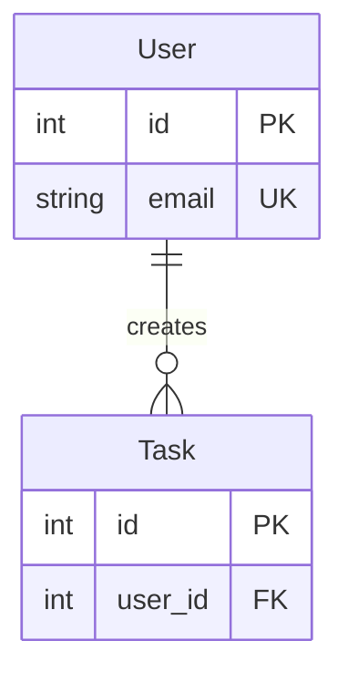

# Entity Detection Specification

## Overview

Automatically detect entities/models in TypeScript and Python codebases and save entity metadata as part of data layer analysis. AI reads entity data from data layer summary during `/analyze` and generates Entity-Relationship (ER) diagrams in system.sm.

**Status**: ✅ Fully implemented in v1.13.0
- ✅ Entity detection (TypeScript & Python)
- ✅ Entity storage in data layer summary JSON
- ✅ AI-generated ER diagrams in analyze.md prompt

## Architecture

Following the v1.12.0 principle: **detection in code, diagram generation in AI prompts**.

Integrated with existing pattern-driven layer detection architecture:

1. **Pattern Matching**: Check file imports against ORM patterns in `data-layer.json`
2. **Tree-sitter Parsing**: If ORM patterns match, extract entities using tree-sitter AST
3. **Data Layer Integration**: Entities stored in data layer summary (`data-layer/summary.json`)
4. **AI Diagram Generation**: AI reads entities from summary during `/analyze` and generates Mermaid ER diagrams

**Why this architecture?**
- Consistent with existing pattern-based detection (databases, APIs, external services)
- Entities naturally belong in data layer (where ORM models live)
- Reuses existing import pattern matching infrastructure
- No separate file needed - entities are part of layer analysis

## Goals

1. **Comprehensive Detection**: Support multiple ORM frameworks and patterns
2. **Relationship Extraction**: Detect foreign keys, one-to-many, many-to-many relationships
3. **Multi-Language**: Support TypeScript and Python
4. **Accurate**: Minimize false positives via multi-signal confidence scoring
5. **JSON Output**: Save structured data for AI consumption

## Detection Patterns

### TypeScript Patterns

#### 1. Decorator-Based (TypeORM, MikroORM, Sequelize-TypeScript)

```typescript
// TypeORM
@Entity('users')
export class User {
  @PrimaryGeneratedColumn()
  id: number;

  @Column()
  name: string;

  @OneToMany(() => Task, task => task.user)
  tasks: Task[];
}

// MikroORM
@Entity()
export class User {
  @PrimaryKey()
  id!: number;

  @Property()
  name!: string;

  @OneToMany(() => Task, task => task.user)
  tasks = new Collection<Task>(this);
}
```

**Detection:**
- Look for `@Entity`, `@Model`, `@Table` decorators on classes
- Extract fields with `@Column`, `@Property`, `@PrimaryKey` decorators
- Extract relationships: `@OneToMany`, `@ManyToOne`, `@ManyToMany`, `@OneToOne`

#### 2. Plain TypeScript Interfaces

```typescript
// Plain interfaces in models files
export interface User {
  id: string;
  name: string;
  email: string;
  createdAt: Date;
}

export interface Task {
  id: string;
  title: string;
  assigneeId: string | null;
  createdAt: Date;
}
```

**Detection:**
- Look for interfaces in entity directories (`models/`, `entities/`, `data/`)
- Look for interfaces in files matching patterns (`.model.ts`, `.entity.ts`)
- Skip DTOs and Input types (names ending with `Input`, `DTO`, `Response`, `Request`)
- Infer primary keys from `id` field
- Infer foreign keys from field names ending with `Id` (e.g., `assigneeId`)
- Detect nullable types from `| null` or `?` syntax

#### 3. Prisma Schema

**Status**: ⚠️ Not yet implemented

```prisma
model User {
  id        Int      @id @default(autoincrement())
  name      String
  email     String   @unique
  tasks     Task[]
  createdAt DateTime @default(now())
}
```

**Future Detection:**
- Parse `schema.prisma` files
- Extract `model` blocks
- Parse field definitions and `@relation` directives

#### 4. Base Class Extension

```typescript
// Custom ORM or base model pattern
export class User extends BaseModel {
  id: number;
  name: string;
  email: string;

  static tableName = 'users';
  static relationships = {
    tasks: { type: 'hasMany', model: 'Task' }
  };
}
```

**Detection:**
- Classes extending `BaseModel`, `Model`, `Entity`, etc.
- Check for `tableName`, `relationships`, `schema` static properties

#### 5. Directory-Based

```
src/
  models/          <- Entity files here
    user.ts
    task.ts
  entities/        <- Or here
    user.entity.ts
  data/
    models/
```

**Detection:**
- Files in directories named: `models`, `entities`, `data`, `domain`, `schemas`, `database`
- Naming patterns: `*.model.ts`, `*.entity.ts`, `*.schema.ts`

#### 6. Zod/Validation Schemas

**Status**: ⚠️ Not yet implemented

```typescript
import { z } from 'zod';

export const UserSchema = z.object({
  id: z.number(),
  name: z.string(),
  email: z.string().email(),
});

export type User = z.infer<typeof UserSchema>;
```

**Future Detection:**
- Exported `z.object()` schemas
- Check if used with database operations

### Python Patterns

#### 1. SQLAlchemy ORM

```python
from sqlalchemy import Column, Integer, String, ForeignKey
from sqlalchemy.orm import relationship, declarative_base

Base = declarative_base()

class User(Base):
    __tablename__ = 'users'

    id = Column(Integer, primary_key=True)
    name = Column(String)
    email = Column(String, unique=True)

    tasks = relationship("Task", back_populates="user")

class Task(Base):
    __tablename__ = 'tasks'

    id = Column(Integer, primary_key=True)
    title = Column(String)
    user_id = Column(Integer, ForeignKey('users.id'))

    user = relationship("User", back_populates="tasks")
```

**Detection:**
- Classes extending `Base`, `DeclarativeBase`, or using `declarative_base()`
- `__tablename__` attribute
- `Column()` definitions
- `relationship()` definitions

#### 2. Django ORM

```python
from django.db import models

class User(models.Model):
    name = models.CharField(max_length=100)
    email = models.EmailField(unique=True)
    created_at = models.DateTimeField(auto_now_add=True)

    class Meta:
        db_table = 'users'

class Task(models.Model):
    title = models.CharField(max_length=200)
    user = models.ForeignKey(User, on_delete=models.CASCADE)
```

**Detection:**
- Classes extending `models.Model`
- Field types: `CharField`, `IntegerField`, `ForeignKey`, etc.
- `ForeignKey`, `OneToOneField`, `ManyToManyField` for relationships

#### 3. Pydantic Models (FastAPI)

```python
from pydantic import BaseModel
from typing import Optional, List

class User(BaseModel):
    id: int
    name: str
    email: str
    tasks: Optional[List['Task']] = None

    class Config:
        orm_mode = True
```

**Detection:**
- Classes extending `BaseModel` from pydantic
- Type hints with relationships (`List[Task]`)
- `orm_mode = True` in Config (indicates it maps to DB)

#### 4. Directory-Based (Python)

```
app/
  models/          <- Entity files here
    user.py
    task.py
  entities/
  domain/
```

**Detection:**
- Files in directories: `models`, `entities`, `domain`, `schemas`
- Naming patterns: `*_model.py`, `*_entity.py`

## Relationship Types to Detect

### One-to-Many (1:N)

**TypeScript:**
- `@OneToMany(() => Task, task => task.user)`
- `tasks: Task[]` with foreign key in Task

**Python:**
- `relationship("Task", back_populates="user")`
- `models.ForeignKey(User, ...)`

**Mermaid syntax:** `User ||--o{ Task : "has"`

### Many-to-One (N:1)

**TypeScript:**
- `@ManyToOne(() => User, user => user.tasks)`
- Foreign key field

**Python:**
- `user_id = Column(Integer, ForeignKey('users.id'))`
- `user = models.ForeignKey(User, ...)`

**Mermaid syntax:** `Task }o--|| User : "belongs to"`

### Many-to-Many (N:M)

**TypeScript:**
- `@ManyToMany(() => Tag, tag => tag.tasks)`
- Join table

**Python:**
- `tags = models.ManyToManyField(Tag)`
- `relationship("Tag", secondary=task_tags)`

**Mermaid syntax:** `Task }o--o{ Tag : "has"`

### One-to-One (1:1)

**TypeScript:**
- `@OneToOne(() => Profile, profile => profile.user)`

**Python:**
- `models.OneToOneField(User, ...)`

**Mermaid syntax:** `User ||--|| Profile : "has"`

## Field Types to Extract

### Primary Keys
- TypeScript: `@PrimaryGeneratedColumn()`, `@PrimaryKey()`, `@id`
- Python: `primary_key=True`, `models.AutoField`
- Mermaid: `id PK`

### Unique Keys
- TypeScript: `@Column({ unique: true })`, `@unique`
- Python: `unique=True`, `models.EmailField(unique=True)`
- Mermaid: `email UK`

### Foreign Keys
- TypeScript: `@ManyToOne`, `@Column() userId: number`
- Python: `ForeignKey`, `user_id = Column(Integer, ForeignKey(...))`
- Mermaid: `user_id FK`

### Regular Fields
- Extract field name, type, nullable
- Map to Mermaid types: `string`, `int`, `boolean`, `date`, `timestamp`

## Implementation Architecture

### Phase 1: Detection (tree-sitter)

```typescript
interface EntityDetector {
  detectEntities(sourceFile: string): Entity[]
  detectRelationships(entity: Entity, sourceFile: string): Relationship[]
}

class TypeScriptEntityDetector implements EntityDetector {
  detectEntities(sourceFile: string): Entity[] {
    // Use tree-sitter to find:
    // 1. Classes with @Entity decorator
    // 2. Classes extending BaseModel
    // 3. Files in models/ directory
  }

  detectRelationships(entity: Entity, sourceFile: string): Relationship[] {
    // Extract @OneToMany, @ManyToOne, etc.
  }
}

class PythonEntityDetector implements EntityDetector {
  detectEntities(sourceFile: string): Entity[] {
    // Use tree-sitter to find:
    // 1. Classes extending models.Model
    // 2. Classes with __tablename__
    // 3. Files in models/ directory
  }
}
```

### Phase 2: Entity Data Structure

```typescript
interface Entity {
  name: string              // e.g., "User"
  tableName?: string        // e.g., "users"
  filePath: string          // e.g., "src/models/user.ts"
  service: string           // e.g., "api-service"
  fields: EntityField[]
  relationships: Relationship[]
}

interface EntityField {
  name: string              // e.g., "email"
  type: string              // e.g., "string", "int"
  isPrimaryKey: boolean
  isUnique: boolean
  isForeignKey: boolean
  isNullable: boolean
  defaultValue?: string
}

interface Relationship {
  type: 'oneToMany' | 'manyToOne' | 'manyToMany' | 'oneToOne'
  targetEntity: string      // e.g., "Task"
  foreignKey?: string       // e.g., "user_id"
  through?: string          // For many-to-many join table
}
```

### Phase 3: Storage in Data Layer Summary

Entities are added to the data layer analysis in `split-analyzer.ts`:

```typescript
// Collect entity extraction tasks (parallel processing)
const entityExtractionTasks: Promise<Entity[]>[] = []

for (const analysis of dataLayerFiles) {
  if (shouldExtractEntities(analysis)) {
    const task = extractEntities(sourceCode, filePath, language, serviceName)
    entityExtractionTasks.push(task)
  }
}

// Wait for all extractions to complete
const allEntities = await Promise.all(entityExtractionTasks)
layers.data.entities.push(...allEntities)

// Include in summary
layers.data.summary = {
  totalEntities: layers.data.entities.length,
  // ... other summary fields
}
```

### Phase 4: AI Diagram Generation

✅ **Implemented in analyze.md prompt**

The AI reads entity data from data layer summary and generates Mermaid ER diagrams during `/analyze`:

**Example ER diagram generated by AI:**



## Storage Structure

**Current Implementation (v1.13.0):**

```
.specmind/
  system/
    services/
      api-service/
        data-layer/
          summary.json        # Contains entities array
          chunk-0.json        # File analysis chunks
      email-service/
        data-layer/
          summary.json
```

Entities are stored in `data-layer/summary.json` as part of the layer analysis:

```json
{
  "layer": "data",
  "summary": {
    "totalEntities": 2
  },
  "entities": [
    { "name": "User", "fields": [...], "relationships": [...] },
    { "name": "Task", "fields": [...], "relationships": [...] }
  ]
}
```

## system.sm Integration

**Note**: This section describes the original design. In the current implementation (v1.13.0), entities are stored in data layer summary JSON and AI generates ER diagrams during `/analyze`.

### Original Design (Not Implemented)

Add new section after Services in system.sm:

**Example Output:**

```markdown
## Data Models

### api-service Entities

The api-service manages the following entities:
```

Then include a Mermaid ER diagram and entity descriptions.

## Testing Strategy

### Test Cases

1. **TypeORM Detection**
   - Task-management example uses PostgreSQL repositories
   - Detect User and Task entities
   - Extract relationships

2. **Django Detection**
   - Create sample Django project
   - Test ForeignKey, ManyToMany detection

3. **Prisma Detection**
   - Sample Prisma schema
   - Test @relation directive parsing

4. **Mixed Patterns**
   - Some entities with decorators
   - Some in models/ directory
   - Ensure all are detected

## Implementation Status

1. ✅ Design entity detection system (this document)
2. ✅ Update @specmind/core with entity detection
3. ✅ Implement TypeScript entity detector
   - ✅ Decorator-based (TypeORM, MikroORM, Sequelize)
   - ✅ Plain interfaces in model files
   - ✅ Base class extension
4. ✅ Implement Python entity detector
   - ✅ SQLAlchemy ORM
   - ✅ Django ORM
   - ✅ Pydantic with orm_mode
5. ✅ Integrate with split analyzer (async entity extraction)
6. ✅ Store entities in data layer summary
7. ✅ Update analyze.md prompt (AI generates ER diagrams)
8. ✅ Update design.md prompt (entity awareness)
9. ✅ Test with TypeScript task-management example
10. ✅ Test with Python task-management example
11. ✅ Document in CONSTITUTION.md (v1.13.0)
12. ✅ Comprehensive test suite (27 tests, all passing)

### Not Yet Implemented

- Prisma schema parsing (.prisma files)
- Zod schema detection (z.object() patterns)

## Implementation Decisions

### Resolved Questions

1. **Confidence Scoring**: ✅ Implemented multi-signal scoring
   - Decorator patterns: 0.5 confidence
   - Base class extension: 0.4 confidence
   - File location: 0.2 confidence
   - Plain interfaces: 0.6 confidence
   - Minimum threshold: 0.4 required

2. **Computed Fields**: ✅ Decision: Extract all fields from AST
   - Include all property declarations
   - Exclude methods and getters
   - Keep virtual relationship fields (they don't have Column decorators)

3. **Multiple ORMs**: ✅ Decision: Merge into one entities array
   - Store framework name on each entity
   - AI can group by framework when generating diagrams
   - Works well for microservices with different ORMs

4. **Pydantic vs Entity Models**: ✅ Decision: Require orm_mode
   - Pydantic without orm_mode = DTO/schema, not entity
   - Only detect Pydantic with `orm_mode = True` in Config

5. **Plain Interfaces**: ✅ Decision: Detect in model files
   - Skip DTOs (Input, Response, Request suffixes)
   - Infer PK from `id` field
   - Infer FK from field names ending with `Id`
   - Lower confidence (0.6) than ORM classes

### Open Questions

1. **Large Schemas**: How to handle 50+ entities?
   - Future: AI could group by module/domain
   - Future: Multiple ER diagrams in system.sm

2. **Schema Evolution**: How to track entity changes over time?
   - Use git for versioning
   - Re-analyze detects schema changes automatically

## Implementation Details

### Code Structure

```
packages/core/src/
├── analyzer/
│   ├── extractors/
│   │   ├── entities.ts                    # Pattern-based entry point
│   │   └── languages/
│   │       ├── typescript-entities.ts     # TypeScript detector
│   │       └── python-entities.ts         # Python detector
│   └── split-analyzer.ts                  # Integration point (async)
├── types/
│   ├── entity.ts                          # Entity type definitions
│   └── index.ts                           # DataLayerAnalysis includes entities
└── __tests__/
    └── extractors/
        └── entities.test.ts               # 27 comprehensive tests
```

### Entry Point Logic

`shouldExtractEntities(analysis: FileAnalysis)` checks:
1. File imports match ORM patterns from `data-layer.json`
2. OR file path includes: `models`, `entities`, `schemas`, `model.`, `entity.`, `schema.`

If true → `extractEntities()` runs language-specific detector

### Integration with Split Analyzer

```typescript
// In splitByLayers() - data layer processing
if (shouldExtractEntities(analysis)) {
  const task = extractEntities(sourceCode, filePath, language, serviceName)
  entityExtractionTasks.push(task)
}

// After file loop - await all extraction tasks
const allEntities = await Promise.all(entityExtractionTasks)
layers.data.entities.push(...allEntities)
```

### Output Format

Entities stored in `.specmind/system/services/{service}/data-layer/summary.json`:

```json
{
  "layer": "data",
  "summary": {
    "totalEntities": 2,
    "orms": ["sqlalchemy"]
  },
  "entities": [
    {
      "name": "User",
      "tableName": "users",
      "framework": "SQLAlchemy",
      "fields": [
        {
          "name": "id",
          "type": "int",
          "isPrimaryKey": true,
          "isUnique": false,
          "isForeignKey": false,
          "isNullable": false
        }
      ],
      "relationships": [
        {
          "type": "oneToMany",
          "targetEntity": "Task"
        }
      ],
      "confidence": 1.1,
      "detectionSignals": ["extends Base (SQLAlchemy)", "has __tablename__ attribute"]
    }
  ]
}
```

### Test Coverage

27 tests covering:
- ✅ Pattern-based detection (shouldExtractEntities)
- ✅ TypeScript: TypeORM, Sequelize, BaseModel, Plain Interfaces
- ✅ Python: Django, SQLAlchemy, Pydantic
- ✅ Relationships: OneToMany, ManyToOne, ManyToMany
- ✅ Field markers: PK, UK, FK
- ✅ File pattern matching
- ✅ Confidence scoring
- ✅ Duplicate prevention (export_statement handling)

All tests passing ✅
