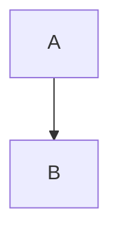

# @specmind/format

.sm file format parser and writer for SpecMind.

## Overview

This package provides the core .sm file format implementation:
- **Zod schemas** for validation and type generation
- **Parser** for converting markdown to SmFile objects
- **Writer** for generating .sm files from SmFile objects
- **Utilities** for feature naming and file paths

## Installation

```bash
npm install @specmind/format
# or
pnpm add @specmind/format
```

## Usage

```typescript
import { parseSmFile, writeSmFile, createFeatureName } from '@specmind/format'

// Parse .sm file content
const content = '# Feature Name\n\n## Overview\nDescription...'
const result = parseSmFile(content, 'feature')

if (result.success) {
  console.log(result.data.name) // "Feature Name"
  console.log(result.data.requirements) // ["req1", "req2"]

  // Write back to markdown
  const writeResult = writeSmFile(result.data)
  console.log(writeResult.content) // Generated .sm content
}

// Create feature names
const featureName = createFeatureName('User Authentication')
console.log(featureName.slug) // "user-authentication"
console.log(featureName.filename) // "user-authentication.sm"
```

## Development

### Commands

```bash
# Build package
pnpm build

# Run unit tests
pnpm test

# Type checking
pnpm lint

# Validate test fixtures (end-to-end)
pnpm validate-fixtures

# Clean build outputs
pnpm clean
```

### Testing Strategy

This package uses **two complementary testing approaches**:

#### **Unit Tests** (`pnpm test`)
- **Purpose**: Test individual functions with controlled inputs
- **Location**: `src/*.test.ts`
- **Speed**: Fast (milliseconds)
- **Examples**:
  - Function behavior with edge cases
  - Error handling and validation
  - Small, focused test cases

#### **Fixture Validation** (`pnpm validate-fixtures`)
- **Purpose**: End-to-end validation with realistic .sm files
- **Location**: `test-fixtures/` + `scripts/validate-fixtures.mjs`
- **Speed**: Slower (file I/O, full parsing)
- **Examples**:
  - Complete feature specifications
  - Complex Mermaid diagrams with subgraphs
  - Real-world content roundtrip testing

**Both are important**: Unit tests catch regressions and edge cases, while fixture validation ensures real-world usage works correctly.

## API Reference

### Types

```typescript
import type { SmFile, FeatureName } from '@specmind/format'
```

### Functions

- `parseSmFile(content, type?)` - Parse .sm content to SmFile object
- `writeSmFile(smFile)` - Convert SmFile object to markdown
- `validateSmFileForWriting(smFile)` - Check for writing issues
- `createFeatureName(name)` - Generate slug and filename from feature name
- `slugify(name)` - Convert string to kebab-case slug
- `getFeatureFilePath(slug)` - Get `.specmind/features/{slug}.sm` path
- `getSystemFilePath()` - Get `.specmind/system.sm` path

## .sm File Format

See [CONSTITUTION.md](../../CONSTITUTION.md) Section 4.2 for complete format specification.

**Example:**
```markdown
# Feature Name

## Overview
Feature description here.

## Requirements
- Requirement 1
- Requirement 2

## Architecture


## Design Decisions
Rationale and trade-offs.

## Integration Points
- Service A: Integration details
- Service B: Integration details

## Notes
Warnings, optimizations, tips.
```